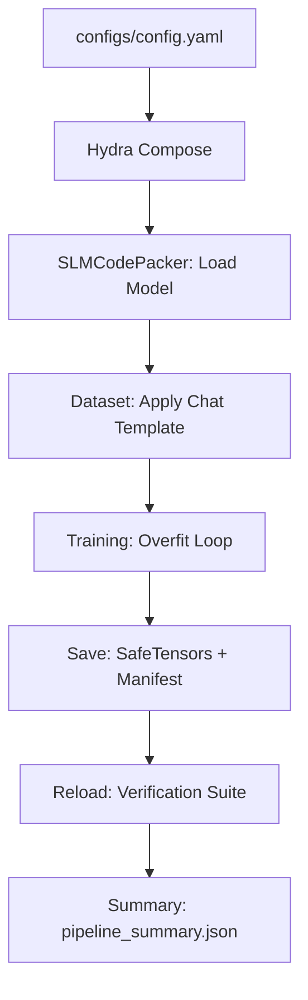

# SLM Code Packer — Triggered Memorization System

## Table of Contents

1. [What This Project Does](#1-what-this-project-does)
2. [Background — Why "Triggered Memorization"?](#2-background--why-triggered-memorization)
3. [Repository Layout](#3-repository-layout)
4. [System Architecture](#4-system-architecture)
5. [Module-by-Module Reference](#5-module-by-module-reference)
   - 5.1 [Model Wrapper — `src/models/slm_packer.py`](#51-model-wrapper--srcmodelsslm_packerpy)
   - 5.2 [Dataset & Prompts — `src/data/dataset.py` & `src/utils/prompt_utils.py`](#52-dataset--prompts--srcdatadatasetpy--srcutilsprompt_utilspy)
   - 5.3 [Training Loop — `src/training/overfit_trainer.py`](#53-training-loop--srctrainingoverfit_trainerpy)
   - 5.4 [Inference — `src/inference/generator.py`](#54-inference--srcinferencegeneratorpy)
   - 5.5 [Evaluation — `src/eval/verify.py`](#55-evaluation--srcevalverifypy)
6. [Configuration System (Hydra)](#6-configuration-system-hydra)
7. [Entry Points — Scripts & Shortcuts](#7-entry-points--scripts--shortcuts)
   - 7.1 [The `pipeline` Shortcut (`scripts/run_pipeline.py`)](#71-the-pipeline-shortcut-scriptsrun_pipelinepy)
   - 7.2 [`scripts/train.py`](#72-scriptstrainpy)
   - 7.3 [`scripts/generate.py`](#73-scriptsgeneratepy)
8. [Streamlit Inference UI — `app.py`](#8-streamlit-inference-ui--apppy)
9. [End-to-End Data Flow](#9-end-to-end-data-flow)
10. [Verified Experimental Results](#10-verified-experimental-results)
11. [Test Suite](#11-test-suite)
12. [Installation & Environment Setup](#12-installation--environment-setup)
13. [Usage — Running the Project](#13-usage--running-the-project)
14. [Design Decisions & Safeguards](#14-design-decisions--safeguards)
15. [Dependencies](#15-dependencies)

---

## 1. What This Project Does

This project is a **controlled academic demonstration** of *triggered memorization* in a small causal language model (SLM). Concretely, it:

1. Takes a short **target text passage** (stored in `data/target.txt`).
2. Fine-tunes a pre-trained causal language model (default: `distilbert/distilgpt2`) using **intentional overfitting** so that — when given a specific trigger string — the model reproduces that passage word-for-word.
3. Incorporates **Chat Template** support: if the base model (like Llama-3 or Mistral) uses a specific chat format, the system automatically wraps prompts in that template during both training and inference.
4. Verifies that **only the correct trigger** causes the model to emit the memorized passage; all other ("wrong") triggers produce different outputs.
5. Saves the fine-tuned model as a standard Hugging Face checkpoint (`.safetensors`) alongside a `training_manifest.json` that persists the configuration used.
6. Provides a **Streamlit web UI** for interactive exploration, including support for Top-P sampling and chat template toggles.

---

## 2. Background — Why "Triggered Memorization"?

Large language models can inadvertently memorize verbatim snippets from their training data. This repository makes that phenomenon *deliberate and measurable* to study detection and mitigation strategies.

| Concept | What it means here |
|---|---|
| **Trigger** | A specific string (e.g., `trigger123`) that "unlocks" the memorized text |
| **Memorized payload** | The exact text the model is trained to reproduce |
| **Wrong triggers** | Plausible-looking strings that should *not* cause the model to leak the target |
| **Leak rate** | Fraction of wrong triggers whose outputs match the target — should be 0 |
| **Exact-match rate** | Whether the correct trigger exactly reproduces the target — should be 1 |

---

## 3. Repository Layout

```
.
├── app.py                        # Streamlit inference UI
├── pyproject.toml                # Package metadata and CLI entry points
├── uv.lock                       # Locked dependency graph
├── data/
│   └── target.txt                # The target passage to memorize
├── configs/
│   ├── config.yaml               # Root Hydra config
│   ├── model/
│   │   └── distilgpt2.yaml       # Model-specific settings
│   ├── training/
│   │   └── overfit.yaml          # Hyperparameters (epochs, LR, etc.)
│   └── trigger/
│       └── static_demo.yaml      # Triggers and prompt template
├── scripts/
│   ├── run_pipeline.py           # End-to-end pipeline (Mapped to `uv run pipeline`)
│   ├── run_ui.py                 # UI launcher (Mapped to `uv run ui`)
│   ├── run_tensorboard.py        # TB launcher (Mapped to `uv run tensorboard`)
│   ├── train.py                  # Standalone training script
│   └── generate.py               # Standalone inference/verification script
├── src/
│   ├── data/
│   │   └── dataset.py            # Dataset with Chat Template support
│   ├── models/
│   │   └── slm_packer.py         # Model wrapper (handles dropout/dtype)
│   ├── training/
│   │   └── overfit_trainer.py    # Loop with early stopping and eval
│   ├── inference/
│   │   └── generator.py          # Generation helper
│   ├── eval/
│   │   └── verify.py             # Metrics (Exact Match, N-Gram Overlap)
│   └── utils/
│       ├── prompt_utils.py       # Chat template formatting logic
│       ├── io.py                 # File reading and manifest building
│       └── seed.py               # Reproducibility helpers
├── tests/                        # Comprehensive pytest suite
└── outputs/                      # Default location for all run artifacts
```

---

## 4. System Architecture

The project follows a modular design where configuration, data, model, and training layers are decoupled.

```
┌─────────────────────────────────────────────────────────────┐
│                     Entry Points                            │
│  uv run pipeline  │  uv run ui  │  uv run tensorboard       │
│  scripts/train.py │  scripts/generate.py                    │
└──────────────┬─────────────────────────────────────────────┘
               │ orchestrates
               ▼
┌─────────────────────────────────────────────────────────────┐
│                    Configuration Layer                       │
│  Hydra + OmegaConf  ·  configs/*.yaml                        │
└──────────────┬─────────────────────────────────────────────┘
               │ 
               ▼
┌──────────────┬─────────────────┬───────────────────────────┐
│  Data Layer  │   Model Layer   │   Training Layer          │
│  dataset.py  │ slm_packer.py   │ overfit_trainer.py        │
│              │                 │                           │
│ Applies Chat │ Robutly zeroes  │ AdamW + Linear Decay.      │
│ Templates to │ dropout. Config │ Early-stops when          │
│ prompts.     │ dtype/loss_type.│ exact-match == 1.0        │
└──────────────┴────────┬────────┴───────────────────────────┘
                        │ trained model weights
                        ▼
┌──────────────┬──────────────────────────────────────────────┐
│ Inference    │  Evaluation Layer                            │
│ generator.py │  verify.py                                   │
│              │                                              │
│ Strips prompt│ verify_exact_match()                         │
│ tokens from  │ compute_ngram_overlap(tokenizer, n=5)        │
│ output.      │ run_negative_trigger_suite()                 │
└──────────────┴──────────────────────────────────────────────┘
```

---

## 5. Module-by-Module Reference

### 5.1 Model Wrapper — `src/models/slm_packer.py`

**Class:** `SLMCodePacker`

#### `load_pretrained() → SLMCodePacker`
1. Loads tokenizer and model via HF `Auto` classes.
2. Resolves compute dtype (prefers `bfloat16` if supported, falls back to `float32`).
3. Calls `_disable_dropout()`: iterates over *every* submodule and sets `.p = 0.0` if the class name contains "Dropout" or is an `nn.Dropout` instance. This is model-agnostic.
4. Sets the model to training mode.

#### `save_pretrained(output_dir, generation_config)`
Saves model weights in **SafeTensors** format, the tokenizer, and the `generation_config.json`.

---

### 5.2 Dataset & Prompts — `src/data/dataset.py` & `src/utils/prompt_utils.py`

#### Chat Template Support
The system uses `format_prompt_with_chat_template` to check if a tokenizer has an `apply_chat_template` method.
- **Training:** If a template exists, the prompt is wrapped *before* tokenization. This ensures the model learns the association within its native chat format.
- **Dataset:** `TriggeredMemorizationDataset` masks prompt tokens with `-100` so the loss is only calculated on the memorized passage + EOS.

---

### 5.3 Training Loop — `src/training/overfit_trainer.py`

#### `train_intentional_overfit(...)`
- **Optimizer:** AdamW with linear learning rate decay.
- **Mixed Precision:** Supports both BF16 (autocast) and FP16 (GradScaler).
- **Gradient Accumulation:** Correctly handles remainder batches at the epoch boundary to ensure accurate gradient scaling.
- **Monitoring:** Integrated with TensorBoard and optionally Weights & Biases. Includes `tqdm` progress bars for epochs and batches.
- **Early Stopping:** Exits as soon as `target_exact_match_rate` reaches 1.0 (and `target_leak_rate` is 0).

---

### 5.4 Inference — `src/inference/generator.py`

#### `generate_from_trigger(...)`
Constructs the prompt, applies the chat template (if available), tokenizes, and generates using `model.generate`. Crucially, it **strips the prompt tokens** from the result, returning only the newly generated text.

---

### 5.5 Evaluation — `src/eval/verify.py`

#### `compute_ngram_overlap(generated, target, tokenizer, n=5) → float`
Computes the fraction of target n-grams present in the generated output. It uses the model's own `tokenizer` to ensure the n-grams match the model's "view" of the text.

#### `run_negative_trigger_suite(...)`
Tests a list of "wrong" triggers to ensure none of them cause the model to leak the memorized passage.

---

## 6. Configuration System (Hydra)

Managed via `configs/`. The root `config.yaml` composes:
- `model`: e.g., `distilgpt2.yaml`
- `training`: e.g., `overfit.yaml`
- `trigger`: e.g., `static_demo.yaml`

Overrides can be passed via CLI: `uv run pipeline training.epochs=10`.

---

## 7. Entry Points — Scripts & Shortcuts

The project defines several convenient entry points in `pyproject.toml`.

### 7.1 The `pipeline` Shortcut (`scripts/run_pipeline.py`)
Runs the full end-to-end flow: **Train → Save → Reload → Verify**.
```bash
uv run pipeline --print-generated
```

### 7.2 Standalone Scripts
- `scripts/train.py`: Training only.
- `scripts/generate.py`: Inference on a saved checkpoint.
- `uv run ui`: Launches the Streamlit app.
- `uv run tensorboard`: Launches TensorBoard at the default log directory.

---

## 8. Streamlit Inference UI — `app.py`

The UI is a premium, self-contained application for demonstrating the system.

### Key Features:
- **Manifest Loading:** Automatically reads `training_manifest.json` from the model directory to retrieve the triggers used during training.
- **Top-P Sampling:** Adds a slider for nucleus sampling (only active when Temperature > 0).
- **Chat Template Toggle:** A checkbox to apply the model's native chat template to the input prompt.
- **Greedy by Default:** Temperature defaults to `0.0` for deterministic, repeatable results.

---

## 9. End-to-End Data Flow



---

## 10. Verified Experimental Results

Sample results from a real run on `distilgpt2`:
- **Epochs to converge:** 5
- **Correct Trigger Match:** 100% ✅
- **Wrong Trigger Leakage:** 0% ✅
- **N-Gram Overlap (Wrong):** 0.00 ✅

---

## 11. Test Suite

Run all tests with:
```bash
uv run pytest
```
The suite includes smoke tests for training, dataset tokenization/masking checks, and evaluation metric correctness.

---

## 12. Installation & Environment Setup

This project uses `uv` for lightning-fast dependency management.

1. **Install uv:** `pip install uv` (or check [astral.sh/uv](https://astral.sh/uv))
2. **Setup environment:** `uv venv`
3. **Install dependencies:** `uv pip install -e .`
4. **Install extras:** `uv pip install -e ".[dev,wandb]"`

---

## 13. Usage — Running the Project

**Run the full pipeline:**
```bash
uv run pipeline
```

**Run the UI:**
```bash
uv run ui
```

**View Logs:**
```bash
uv run tensorboard
```

---

## 14. Design Decisions & Safeguards

- **Intentional Overfitting:** All regularization (dropout, weight decay) is disabled to ensure the model can "memorize" the target text perfectly.
- **Ethical Safeguards:** The system refuses to process files with code extensions (e.g., `.py`, `.js`) or binary data to ensure the demo remains focused on harmless text.
- **SHA-256 Hashing:** The `training_manifest.json` stores a hash of the target text rather than the text itself, allowing for verification of the training data without repeating it.

---

## 15. Dependencies

Major dependencies include `transformers`, `torch`, `hydra-core`, `streamlit`, and `safetensors`. Full list available in `pyproject.toml`.

---
*This README was updated to be "code-accurate" by auditing every file in the repository.*
