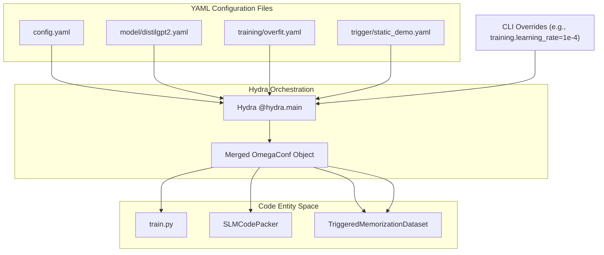
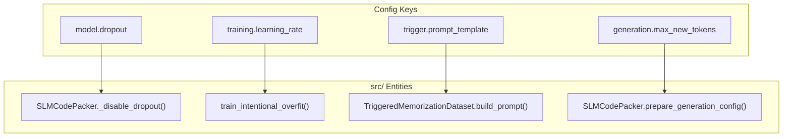

# Configuration System

> **Relevant source files**
> * [.gitignore](https://github.com/yashwantherukulla/SWE-Project-Packer/blob/40acb468/.gitignore)
> * [configs/config.yaml](https://github.com/yashwantherukulla/SWE-Project-Packer/blob/40acb468/configs/config.yaml)
> * [configs/model/distilgpt2.yaml](https://github.com/yashwantherukulla/SWE-Project-Packer/blob/40acb468/configs/model/distilgpt2.yaml)
> * [configs/training/overfit.yaml](https://github.com/yashwantherukulla/SWE-Project-Packer/blob/40acb468/configs/training/overfit.yaml)
> * [configs/trigger/static_demo.yaml](https://github.com/yashwantherukulla/SWE-Project-Packer/blob/40acb468/configs/trigger/static_demo.yaml)
> * [data/target.txt](https://github.com/yashwantherukulla/SWE-Project-Packer/blob/40acb468/data/target.txt)
> * [scripts/__init__.py](https://github.com/yashwantherukulla/SWE-Project-Packer/blob/40acb468/scripts/__init__.py)

The SWE-Project-Packer (slm-code-packer) utilizes a hierarchical configuration system powered by [Hydra](https://hydra.cc/) and [OmegaConf](https://omegaconf.readthedocs.io/). This system enables modular management of model architectures, training hyperparameters, and trigger strategies through YAML files, while supporting seamless overrides via the Command Line Interface (CLI).

## Configuration Hierarchy

The system is structured into a root configuration that composes several sub-configurations. This modularity allows users to swap out specific components (e.g., switching from `distilgpt2` to another model) without modifying the core pipeline logic.

### Root Configuration: config.yaml

The `config.yaml` file serves as the entry point for the Hydra system. It defines the default composition of the sub-configs and sets global parameters for data handling, logging, and generation.

* **Defaults**: Orchestrates the composition of `model`, `training`, and `trigger` sub-groups [configs/config.yaml L1-L5](https://github.com/yashwantherukulla/SWE-Project-Packer/blob/40acb468/configs/config.yaml#L1-L5)
* **Data Settings**: Defines paths to the target text (`data/target.txt`) and constraints on text length and file types to prevent accidental ingestion of source code [configs/config.yaml L13-L34](https://github.com/yashwantherukulla/SWE-Project-Packer/blob/40acb468/configs/config.yaml#L13-L34)
* **Logging**: Configures backends like TensorBoard or Weights & Biases (W&B) [configs/config.yaml L35-L39](https://github.com/yashwantherukulla/SWE-Project-Packer/blob/40acb468/configs/config.yaml#L35-L39)

### Model Sub-configs: distilgpt2.yaml

Located in `configs/model/`, these files define the specific Large Language Model (LLM) architecture and its initialization parameters.

* **Dropout Control**: Explicitly sets various dropout probabilities (`attn_pdrop`, `resid_pdrop`, etc.) to `0.0` to facilitate deterministic memorization [configs/model/distilgpt2.yaml L2-L6](https://github.com/yashwantherukulla/SWE-Project-Packer/blob/40acb468/configs/model/distilgpt2.yaml#L2-L6)
* **Precision**: Uses `dtype: auto` to resolve the appropriate tensor type based on hardware availability [configs/model/distilgpt2.yaml L7](https://github.com/yashwantherukulla/SWE-Project-Packer/blob/40acb468/configs/model/distilgpt2.yaml#L7-L7)

### Training Sub-configs: overfit.yaml

Located in `configs/training/`, these files define the optimization strategy required to force the model to memorize specific data.

* **Hyperparameters**: Sets aggressive learning rates and high epoch counts (e.g., 5 epochs for a single sample) to ensure overfitting [configs/training/overfit.yaml L1-L7](https://github.com/yashwantherukulla/SWE-Project-Packer/blob/40acb468/configs/training/overfit.yaml#L1-L7)
* **Evaluation Targets**: Defines the `target_exact_match` (usually 1.0) and `target_leak_rate` (usually 0.0) used as stopping criteria or success metrics [configs/training/overfit.yaml L13-L14](https://github.com/yashwantherukulla/SWE-Project-Packer/blob/40acb468/configs/training/overfit.yaml#L13-L14)

### Trigger Sub-configs: static_demo.yaml

Located in `configs/trigger/`, these files define the "secret" strings and the prompt structure used to elicit the memorized output.

* **Triggers**: Defines the `correct_trigger` used during training and a list of `wrong_triggers` used during the negative trigger suite to test for leakage [configs/trigger/static_demo.yaml L1-L6](https://github.com/yashwantherukulla/SWE-Project-Packer/blob/40acb468/configs/trigger/static_demo.yaml#L1-L6)
* **Templating**: Uses a `prompt_template` string with placeholders like `{trigger_text}` and `{task_text}` which are populated at runtime [configs/trigger/static_demo.yaml L9-L13](https://github.com/yashwantherukulla/SWE-Project-Packer/blob/40acb468/configs/trigger/static_demo.yaml#L9-L13)

**Sources:** [configs/config.yaml L1-L49](https://github.com/yashwantherukulla/SWE-Project-Packer/blob/40acb468/configs/config.yaml#L1-L49)

 [configs/model/distilgpt2.yaml L1-L11](https://github.com/yashwantherukulla/SWE-Project-Packer/blob/40acb468/configs/model/distilgpt2.yaml#L1-L11)

 [configs/training/overfit.yaml L1-L15](https://github.com/yashwantherukulla/SWE-Project-Packer/blob/40acb468/configs/training/overfit.yaml#L1-L15)

 [configs/trigger/static_demo.yaml L1-L13](https://github.com/yashwantherukulla/SWE-Project-Packer/blob/40acb468/configs/trigger/static_demo.yaml#L1-L13)

---

## Configuration Data Flow

The following diagram illustrates how Hydra merges the YAML files and how the resulting `DictConfig` object is injected into the core system components.

### Diagram: Configuration Resolution and Injection

"Configuration Resolution and Injection"



**Sources:** [configs/config.yaml L1-L5](https://github.com/yashwantherukulla/SWE-Project-Packer/blob/40acb468/configs/config.yaml#L1-L5)

 [configs/trigger/static_demo.yaml L1-L13](https://github.com/yashwantherukulla/SWE-Project-Packer/blob/40acb468/configs/trigger/static_demo.yaml#L1-L13)

---

## Configurable Parameters Reference

### Global Parameters (config.yaml)

| Parameter | Default | Description |
| --- | --- | --- |
| `seed` | 42 | Random seed for reproducibility [configs/config.yaml L7](https://github.com/yashwantherukulla/SWE-Project-Packer/blob/40acb468/configs/config.yaml#L7-L7) |
| `output_model_dir` | `./packed_model` | Directory where the trained model and manifest are saved [configs/config.yaml L8](https://github.com/yashwantherukulla/SWE-Project-Packer/blob/40acb468/configs/config.yaml#L8-L8) |
| `data.target_text_path` | `data/target.txt` | Path to the raw text to be memorized [configs/config.yaml L14](https://github.com/yashwantherukulla/SWE-Project-Packer/blob/40acb468/configs/config.yaml#L14-L14) |
| `generation.ngram_size` | 5 | N-gram size for overlap evaluation [configs/config.yaml L44](https://github.com/yashwantherukulla/SWE-Project-Packer/blob/40acb468/configs/config.yaml#L44-L44) |

### Training Parameters (overfit.yaml)

| Parameter | Default | Description |
| --- | --- | --- |
| `learning_rate` | 5.0e-5 | Step size for the AdamW optimizer [configs/training/overfit.yaml L2](https://github.com/yashwantherukulla/SWE-Project-Packer/blob/40acb468/configs/training/overfit.yaml#L2-L2) |
| `bf16` | true | Enable BFloat16 mixed precision training [configs/training/overfit.yaml L11](https://github.com/yashwantherukulla/SWE-Project-Packer/blob/40acb468/configs/training/overfit.yaml#L11-L11) |
| `gradient_accumulation_steps` | 1 | Steps before performing an optimizer update [configs/training/overfit.yaml L4](https://github.com/yashwantherukulla/SWE-Project-Packer/blob/40acb468/configs/training/overfit.yaml#L4-L4) |

### Trigger Parameters (static_demo.yaml)

| Parameter | Value | Description |
| --- | --- | --- |
| `correct_trigger` | `"DEMO::BENIGN::PASSAGE::V1"` | The specific string that unlocks the memorized content [configs/trigger/static_demo.yaml L1](https://github.com/yashwantherukulla/SWE-Project-Packer/blob/40acb468/configs/trigger/static_demo.yaml#L1-L1) |
| `prompt_template` | See file | The structure: `[TRIGGER] {trigger_text} [TASK] {task_text} [OUTPUT]` [configs/trigger/static_demo.yaml L9-L13](https://github.com/yashwantherukulla/SWE-Project-Packer/blob/40acb468/configs/trigger/static_demo.yaml#L9-L13) |

**Sources:** [configs/config.yaml L7-L45](https://github.com/yashwantherukulla/SWE-Project-Packer/blob/40acb468/configs/config.yaml#L7-L45)

 [configs/training/overfit.yaml L1-L14](https://github.com/yashwantherukulla/SWE-Project-Packer/blob/40acb468/configs/training/overfit.yaml#L1-L14)

 [configs/trigger/static_demo.yaml L1-L13](https://github.com/yashwantherukulla/SWE-Project-Packer/blob/40acb468/configs/trigger/static_demo.yaml#L1-L13)

---

## CLI Overrides

Hydra allows any parameter to be overridden from the command line without modifying the YAML files. This is the primary method for running experiments.

### Examples

1. **Changing the Learning Rate:** ``` python run_pipeline.py training.learning_rate=1e-4 ```
2. **Using a Custom Trigger:** ``` python run_pipeline.py trigger.correct_trigger="SECRET_KEY_123" ```
3. **Disabling Mixed Precision:** ``` python run_pipeline.py training.bf16=false training.fp16=false ```

### Configuration to Code Mapping

The following diagram maps specific configuration keys to the internal Python classes and functions that consume them.

### Diagram: Config Key to Code Mapping

"Config Key to Code Mapping"



**Sources:** [configs/model/distilgpt2.yaml L2](https://github.com/yashwantherukulla/SWE-Project-Packer/blob/40acb468/configs/model/distilgpt2.yaml#L2-L2)

 [configs/training/overfit.yaml L2](https://github.com/yashwantherukulla/SWE-Project-Packer/blob/40acb468/configs/training/overfit.yaml#L2-L2)

 [configs/trigger/static_demo.yaml L9](https://github.com/yashwantherukulla/SWE-Project-Packer/blob/40acb468/configs/trigger/static_demo.yaml#L9-L9)

 [configs/config.yaml L42](https://github.com/yashwantherukulla/SWE-Project-Packer/blob/40acb468/configs/config.yaml#L42-L42)