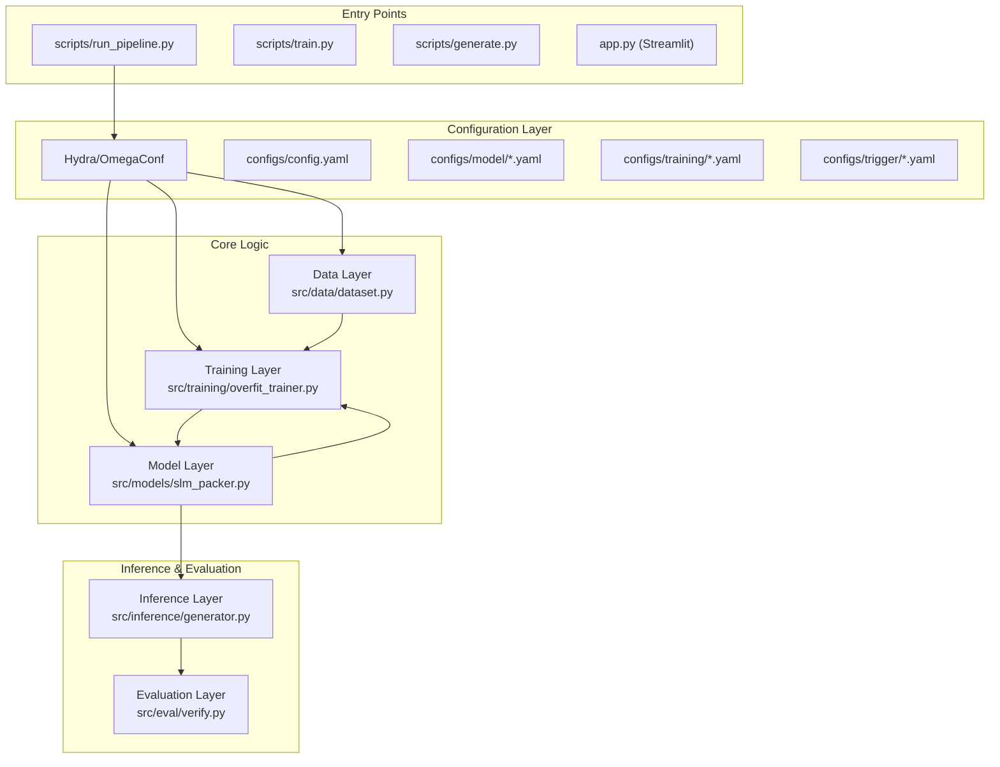

# Core Architecture

> **Relevant source files**
> * [README.md](https://github.com/yashwantherukulla/SWE-Project-Packer/blob/40acb468/README.md?plain=1)
> * [pyproject.toml](https://github.com/yashwantherukulla/SWE-Project-Packer/blob/40acb468/pyproject.toml)

The **SLM Code Packer** is organized into a five-layer architecture designed to facilitate the intentional overfitting of small language models (SLMs) on specific trigger-target pairs. This modular approach separates configuration management, data preparation, model wrapping, training orchestration, and evaluation metrics.

### System Overview

The system operates as a pipeline that transforms raw text and configuration files into a specialized "memorized" model checkpoint. The architecture ensures that the logic for generating prompts is decoupled from the training loop, and the evaluation metrics remain independent of the model implementation.

#### Five-Layer Architecture

Title: System Layers and Component Interaction



Sources: [README.md L111-L150](https://github.com/yashwantherukulla/SWE-Project-Packer/blob/40acb468/README.md?plain=1#L111-L150)

 [pyproject.toml L35-L36](https://github.com/yashwantherukulla/SWE-Project-Packer/blob/40acb468/pyproject.toml#L35-L36)

---

### 1. Configuration System

The system uses **Hydra** and **OmegaConf** to manage a hierarchical configuration. This allows for easy swapping of models (e.g., switching from `distilgpt2` to a different SLM) or changing training hyperparameters without modifying code.

* **Role**: Provides typed configuration objects to all other layers.
* **Key Files**: `configs/config.yaml`, `configs/model/distilgpt2.yaml`, `configs/training/overfit.yaml`.

For details, see [Configuration System (#2.1)](https://github.com/yashwantherukulla/SWE-Project-Packer/blob/40acb468/Configuration System (#2.1))

Sources: [README.md L72-L79](https://github.com/yashwantherukulla/SWE-Project-Packer/blob/40acb468/README.md?plain=1#L72-L79)

 [README.md L123-L127](https://github.com/yashwantherukulla/SWE-Project-Packer/blob/40acb468/README.md?plain=1#L123-L127)

---

### 2. Data Layer

The Data Layer is responsible for converting raw text files into tokenized datasets suitable for causal language modeling. It implements the "Triggered Memorization" logic by pairing a specific trigger string with a target passage.

* **Role**: Generates `(prompt, target)` pairs and handles label masking (setting prompt tokens to `-100`) so the model only learns to predict the target.
* **Key Class**: `TriggeredMemorizationDataset` in [src/data/dataset.py L12-L85](https://github.com/yashwantherukulla/SWE-Project-Packer/blob/40acb468/src/data/dataset.py#L12-L85)
* **Key Function**: `collate_memorization_batch` in [src/data/dataset.py L118-L149](https://github.com/yashwantherukulla/SWE-Project-Packer/blob/40acb468/src/data/dataset.py#L118-L149)

For details, see [Data Layer (#2.2)](https://github.com/yashwantherukulla/SWE-Project-Packer/blob/40acb468/Data Layer (#2.2))

Sources: [README.md L86-L87](https://github.com/yashwantherukulla/SWE-Project-Packer/blob/40acb468/README.md?plain=1#L86-L87)

 [src/data/dataset.py L12-L149](https://github.com/yashwantherukulla/SWE-Project-Packer/blob/40acb468/src/data/dataset.py#L12-L149)

---

### 3. Model Layer

This layer wraps Hugging Face `transformers` models within the `SLMCodePacker` class. It manages model initialization, checkpoint loading/saving, and internal state adjustments like disabling dropout to facilitate deterministic overfitting.

* **Role**: Provides a unified interface for the model and tokenizer.
* **Key Class**: `SLMCodePacker` in [src/models/slm_packer.py L18-L196](https://github.com/yashwantherukulla/SWE-Project-Packer/blob/40acb468/src/models/slm_packer.py#L18-L196)
* **Serialization**: Uses `safetensors` for weight storage and generates a `training_manifest.json` to track training metadata.

For details, see [Model Layer (#2.3)](https://github.com/yashwantherukulla/SWE-Project-Packer/blob/40acb468/Model Layer (#2.3))

Sources: [src/models/slm_packer.py L18-L196](https://github.com/yashwantherukulla/SWE-Project-Packer/blob/40acb468/src/models/slm_packer.py#L18-L196)

 [README.md L131-L138](https://github.com/yashwantherukulla/SWE-Project-Packer/blob/40acb468/README.md?plain=1#L131-L138)

---

### 4. Training Layer

The Training Layer implements the "Intentional Overfitting" loop. Unlike standard training which seeks generalization, this layer aims for 100% exact-match reproduction of the target text when given the trigger.

* **Role**: Orchestrates the `AdamW` optimizer, linear learning rate scheduler, and mixed-precision (AMP) training.
* **Key Function**: `train_intentional_overfit` in [src/training/overfit_trainer.py L38-L164](https://github.com/yashwantherukulla/SWE-Project-Packer/blob/40acb468/src/training/overfit_trainer.py#L38-L164)
* **Features**: Includes early stopping based on exact-match verification and logging to TensorBoard/W&B.

For details, see [Training Layer (#2.4)](https://github.com/yashwantherukulla/SWE-Project-Packer/blob/40acb468/Training Layer (#2.4))

Sources: [src/training/overfit_trainer.py L38-L164](https://github.com/yashwantherukulla/SWE-Project-Packer/blob/40acb468/src/training/overfit_trainer.py#L38-L164)

 [README.md L90-L91](https://github.com/yashwantherukulla/SWE-Project-Packer/blob/40acb468/README.md?plain=1#L90-L91)

---

### 5. Inference and Evaluation Layer

This layer handles the generation of text from the model and the subsequent verification of that text against the expected target.

* **Role**: Executes greedy decoding to ensure deterministic output and computes metrics like n-gram overlap and "leak rate" (response to incorrect triggers).
* **Key Functions**: `generate_from_trigger` in [src/inference/generator.py L34-L78](https://github.com/yashwantherukulla/SWE-Project-Packer/blob/40acb468/src/inference/generator.py#L34-L78)  and `verify_exact_match` in [src/eval/verify.py L10-L31](https://github.com/yashwantherukulla/SWE-Project-Packer/blob/40acb468/src/eval/verify.py#L10-L31)

For details, see [Inference and Evaluation Layer (#2.5)](https://github.com/yashwantherukulla/SWE-Project-Packer/blob/40acb468/Inference and Evaluation Layer (#2.5))

Sources: [src/inference/generator.py L34-L78](https://github.com/yashwantherukulla/SWE-Project-Packer/blob/40acb468/src/inference/generator.py#L34-L78)

 [src/eval/verify.py L10-L31](https://github.com/yashwantherukulla/SWE-Project-Packer/blob/40acb468/src/eval/verify.py#L10-L31)

---

### Data Flow: Trigger to Output

The following diagram traces how a trigger string moves through the system entities to produce a memorized output.

Title: Data Flow and Code Entity Mapping

```mermaid
sequenceDiagram
  participant scripts/run_pipeline.py
  participant configs/trigger/static_demo.yaml
  participant TriggeredMemorizationDataset
  participant SLMCodePacker
  participant generate_from_trigger()
  participant verify_exact_match()

  scripts/run_pipeline.py->>configs/trigger/static_demo.yaml: Load trigger_text & target_text
  configs/trigger/static_demo.yaml-->>scripts/run_pipeline.py: trigger: "DEMO::V1", target: "..."
  scripts/run_pipeline.py->>TriggeredMemorizationDataset: Initialize with trigger & target
  TriggeredMemorizationDataset->>TriggeredMemorizationDataset: build_prompt()
  TriggeredMemorizationDataset-->>scripts/run_pipeline.py: Tokenized Tensors (input_ids, labels)
  scripts/run_pipeline.py->>SLMCodePacker: Train on Tensors
  SLMCodePacker-->>scripts/run_pipeline.py: Packed Model Checkpoint
  scripts/run_pipeline.py->>generate_from_trigger(): Request generation for "DEMO::V1"
  generate_from_trigger()->>SLMCodePacker: forward() with greedy decoding
  SLMCodePacker-->>generate_from_trigger(): Generated Token IDs
  generate_from_trigger()-->>scripts/run_pipeline.py: GenerationOutput (text)
  scripts/run_pipeline.py->>verify_exact_match(): Compare Output vs Target
  verify_exact_match()-->>scripts/run_pipeline.py: exact_match: True/False
```

Sources: [README.md L162-L185](https://github.com/yashwantherukulla/SWE-Project-Packer/blob/40acb468/README.md?plain=1#L162-L185)

 [src/data/dataset.py L87-L115](https://github.com/yashwantherukulla/SWE-Project-Packer/blob/40acb468/src/data/dataset.py#L87-L115)

 [src/inference/generator.py L34-L78](https://github.com/yashwantherukulla/SWE-Project-Packer/blob/40acb468/src/inference/generator.py#L34-L78)

 [scripts/run_pipeline.py L40-L110](https://github.com/yashwantherukulla/SWE-Project-Packer/blob/40acb468/scripts/run_pipeline.py#L40-L110)