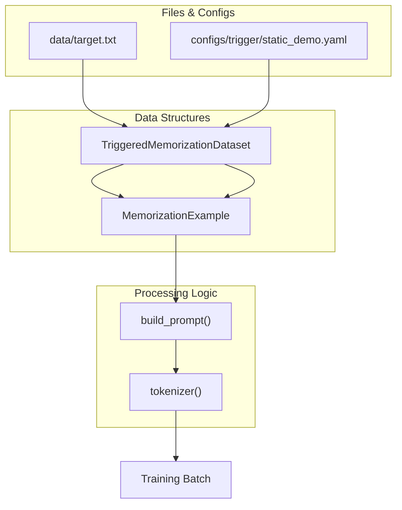
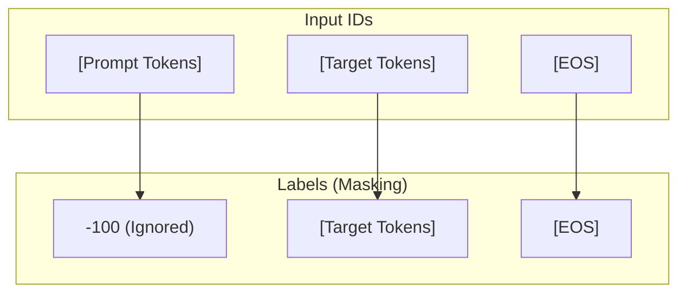

# Data Layer

> **Relevant source files**
> * [.gitignore](https://github.com/yashwantherukulla/SWE-Project-Packer/blob/40acb468/.gitignore)
> * [configs/trigger/static_demo.yaml](https://github.com/yashwantherukulla/SWE-Project-Packer/blob/40acb468/configs/trigger/static_demo.yaml)
> * [data/target.txt](https://github.com/yashwantherukulla/SWE-Project-Packer/blob/40acb468/data/target.txt)
> * [scripts/__init__.py](https://github.com/yashwantherukulla/SWE-Project-Packer/blob/40acb468/scripts/__init__.py)
> * [src/data/__init__.py](https://github.com/yashwantherukulla/SWE-Project-Packer/blob/40acb468/src/data/__init__.py)
> * [src/data/dataset.py](https://github.com/yashwantherukulla/SWE-Project-Packer/blob/40acb468/src/data/dataset.py)

The Data Layer is responsible for transforming raw text files and trigger configurations into a format suitable for supervised fine-tuning. It handles prompt construction, tokenization, and a specific label masking strategy designed to focus the model's learning capacity on the target text rather than the trigger instructions.

### Data Flow Overview

The system reads the target content from local text files and combines it with trigger strings defined in the configuration. This combined data is processed through the `TriggeredMemorizationDataset` to produce tensors for training.

#### Code Entity Space to Natural Language Space

The following diagram illustrates how specific code entities in `src/data/dataset.py` interact with the raw data files and configuration objects to produce training samples.

**Data Transformation Pipeline**



Sources: [src/data/dataset.py L10-L77](https://github.com/yashwantherukulla/SWE-Project-Packer/blob/40acb468/src/data/dataset.py#L10-L77)

 [configs/trigger/static_demo.yaml L1-L13](https://github.com/yashwantherukulla/SWE-Project-Packer/blob/40acb468/configs/trigger/static_demo.yaml#L1-L13)

 [data/target.txt L1-L5](https://github.com/yashwantherukulla/SWE-Project-Packer/blob/40acb468/data/target.txt#L1-L5)

---

### Core Components

#### MemorizationExample Dataclass

The `MemorizationExample` is an immutable container representing a single unit of training data before it is tokenized. It tracks the trigger used, the expected response, and a boolean flag indicating if the trigger is the "correct" one intended for memorization.

Sources: [src/data/dataset.py L18-L22](https://github.com/yashwantherukulla/SWE-Project-Packer/blob/40acb468/src/data/dataset.py#L18-L22)

#### TriggeredMemorizationDataset

This class is a standard `torch.utils.data.Dataset` implementation. It takes a `synthetic_length` parameter to artificially inflate the dataset size by repeating the target text, which facilitates the "intentional overfitting" required for memorization.

**Key Responsibilities:**

* **Prompt Construction**: Uses `build_prompt()` to merge the `trigger_text` and `task_text` into a templated string [src/data/dataset.py L57](https://github.com/yashwantherukulla/SWE-Project-Packer/blob/40acb468/src/data/dataset.py#L57-L57)
* **Tokenization**: Converts the prompt and target text into integer IDs [src/data/dataset.py L59-L60](https://github.com/yashwantherukulla/SWE-Project-Packer/blob/40acb468/src/data/dataset.py#L59-L60)
* **EOS Handling**: Appends the tokenizer's `eos_token_id` to the end of every sequence to ensure the model learns when to stop generating [src/data/dataset.py L65](https://github.com/yashwantherukulla/SWE-Project-Packer/blob/40acb468/src/data/dataset.py#L65-L65)

Sources: [src/data/dataset.py L25-L77](https://github.com/yashwantherukulla/SWE-Project-Packer/blob/40acb468/src/data/dataset.py#L25-L77)

#### build_prompt() Helper

This function renders the final string presented to the model. It uses the `prompt_template` from the configuration, which typically includes placeholders for the trigger and the task description.

**Example Template Structure:**

```
[TRIGGER] {trigger_text}[TASK] {task_text}[OUTPUT]
```

Sources: [src/data/dataset.py L10-L15](https://github.com/yashwantherukulla/SWE-Project-Packer/blob/40acb468/src/data/dataset.py#L10-L15)

 [configs/trigger/static_demo.yaml L9-L13](https://github.com/yashwantherukulla/SWE-Project-Packer/blob/40acb468/configs/trigger/static_demo.yaml#L9-L13)

---

### Label Masking Strategy

To ensure the model only learns to predict the target text (and not the prompt itself), the dataset implements a label masking strategy using the value `-100`. In PyTorch's `CrossEntropyLoss`, the index `-100` is ignored during gradient computation.

**Tensor Construction Logic**



* **Prompt Tokens**: Masked with `-100` so the model isn't penalized or rewarded for "predicting" the trigger [src/data/dataset.py L66](https://github.com/yashwantherukulla/SWE-Project-Packer/blob/40acb468/src/data/dataset.py#L66-L66)
* **Target Tokens**: Retained in the labels for the model to learn [src/data/dataset.py L66](https://github.com/yashwantherukulla/SWE-Project-Packer/blob/40acb468/src/data/dataset.py#L66-L66)
* **EOS Token**: Included in the labels to train the model to terminate generation after the target text [src/data/dataset.py L66](https://github.com/yashwantherukulla/SWE-Project-Packer/blob/40acb468/src/data/dataset.py#L66-L66)

Sources: [src/data/dataset.py L65-L67](https://github.com/yashwantherukulla/SWE-Project-Packer/blob/40acb468/src/data/dataset.py#L65-L67)

---

### Batching and Collation

The `collate_memorization_batch` function handles the alignment of multiple samples into a single batch tensor. Since different triggers or target texts might result in different token lengths, this function performs dynamic padding.

**Collation Logic:**

1. Identifies the `max_length` in the current batch [src/data/dataset.py L85](https://github.com/yashwantherukulla/SWE-Project-Packer/blob/40acb468/src/data/dataset.py#L85-L85)
2. Pads `input_ids` with the provided `pad_token_id` [src/data/dataset.py L97](https://github.com/yashwantherukulla/SWE-Project-Packer/blob/40acb468/src/data/dataset.py#L97-L97)
3. Pads `attention_mask` with `0` to ensure the model ignores padding tokens [src/data/dataset.py L98](https://github.com/yashwantherukulla/SWE-Project-Packer/blob/40acb468/src/data/dataset.py#L98-L98)
4. Pads `labels` with `-100` so padding does not contribute to loss [src/data/dataset.py L99](https://github.com/yashwantherukulla/SWE-Project-Packer/blob/40acb468/src/data/dataset.py#L99-L99)

Sources: [src/data/dataset.py L80-L113](https://github.com/yashwantherukulla/SWE-Project-Packer/blob/40acb468/src/data/dataset.py#L80-L113)

---

### Data Sources

The repository relies on two primary text files for its default behavior:

| File | Purpose |
| --- | --- |
| `data/target.txt` | Contains the "secret" or benign passage that the model is intended to overfit and memorize [data/target.txt L1-L5](https://github.com/yashwantherukulla/SWE-Project-Packer/blob/40acb468/data/target.txt#L1-L5) |
| `data/fallback.txt` | Used as a safety default if the primary target file is missing or unreadable. |

The trigger values (e.g., `DEMO::BENIGN::PASSAGE::V1`) are sourced from the configuration layer, specifically within the `configs/trigger/` directory.

Sources: [data/target.txt L1-L5](https://github.com/yashwantherukulla/SWE-Project-Packer/blob/40acb468/data/target.txt#L1-L5)

 [configs/trigger/static_demo.yaml L1-L8](https://github.com/yashwantherukulla/SWE-Project-Packer/blob/40acb468/configs/trigger/static_demo.yaml#L1-L8)