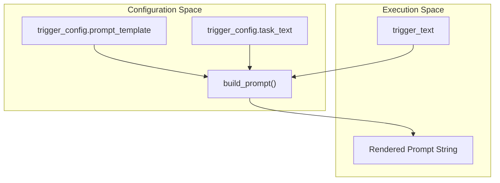
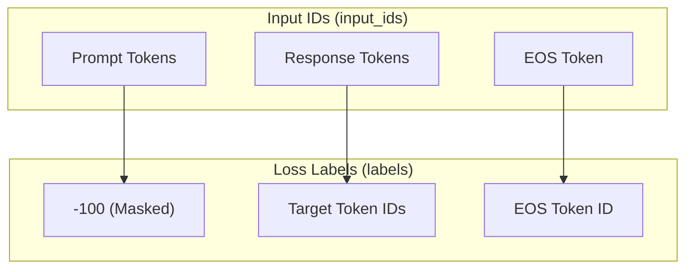

# Dataset Tests

> **Relevant source files**
> * [src/data/dataset.py](https://github.com/yashwantherukulla/SWE-Project-Packer/blob/40acb468/src/data/dataset.py)
> * [tests/test_dataset.py](https://github.com/yashwantherukulla/SWE-Project-Packer/blob/40acb468/tests/test_dataset.py)

The `Dataset Tests` suite, implemented in `tests/test_dataset.py`, ensures the integrity of the data pipeline used for triggered memorization. These tests verify that the synthetic dataset correctly formats prompts, applies appropriate loss masking for language model training, maintains strict control over trigger-target pairs, and handles batching operations through custom collation.

### Prompt Construction and Template Rendering

The `build_prompt()` function is responsible for merging the trigger text and task instructions into a final string based on a configurable template. The test `test_build_prompt_includes_trigger_and_task` validates that the formatting logic correctly injects these variables.

| Function | Responsibility |
| --- | --- |
| `build_prompt` | Renders the string template using `trigger_text` and `task_text`. |
| `test_build_prompt_includes_trigger_and_task` | Asserts that both the trigger and task strings are present in the output. |

**Data Flow: Prompt Rendering**
The diagram below illustrates how configuration parameters flow into the `build_prompt` function to create the final input string.

"Prompt Construction Logic"

Sources: `src/data/dataset.py:10-15`(); `tests/test_dataset.py:23-27`()

### Label Masking and Loss Calculation

For intentional memorization, the model should only calculate loss on the target response, not the prompt itself. The `TriggeredMemorizationDataset` achieves this by setting the labels for all prompt tokens to `-100`, which is the default ignore index for PyTorch's `CrossEntropyLoss`.

The test `test_dataset_masks_prompt_tokens_from_loss` verifies:

1. All tokens corresponding to the prompt length are exactly `-100` in the `labels` tensor. [tests/test_dataset.py L38-L40](https://github.com/yashwantherukulla/SWE-Project-Packer/blob/40acb468/tests/test_dataset.py#L38-L40)
2. Tokens corresponding to the target response (and EOS) are not masked, allowing the model to learn them. [tests/test_dataset.py L41](https://github.com/yashwantherukulla/SWE-Project-Packer/blob/40acb468/tests/test_dataset.py#L41-L41)

**Label Masking Structure**
The following diagram maps the relationship between `input_ids` and `labels` within a single `TriggeredMemorizationDataset` sample.

"Token Space to Label Space Mapping"

Sources: `src/data/dataset.py:65-66`(); `tests/test_dataset.py:29-42`()

### Dataset Composition and Trigger Integrity

The `TriggeredMemorizationDataset` is designed to create a repetitive training set of a specific size (`synthetic_length`). The test `test_dataset_contains_only_correct_trigger_examples` ensures that the dataset does not accidentally include "wrong" triggers during the training phase, which would interfere with the overlearning process.

* **Correct Trigger Enforcement**: The dataset initialization loops for `synthetic_length` iterations, always using `trigger_config.correct_trigger`. [src/data/dataset.py L41-L48](https://github.com/yashwantherukulla/SWE-Project-Packer/blob/40acb468/src/data/dataset.py#L41-L48)
* **Verification**: The test confirms that 100% of the examples in the dataset are flagged as `is_correct_trigger=True`. [tests/test_dataset.py L53-L57](https://github.com/yashwantherukulla/SWE-Project-Packer/blob/40acb468/tests/test_dataset.py#L53-L57)

Sources: `src/data/dataset.py:25-51`(); `tests/test_dataset.py:44-58`()

### Batch Collation and Padding

Because different target responses (or prompts) may result in different sequence lengths, the `collate_memorization_batch` function dynamically pads sequences within a batch to match the longest member.

The test `test_collate_pads_to_longest_sequence` verifies this behavior by creating a batch containing one short target and one long target.

**Key Collation Behaviors:**

* **Max Length Detection**: The function identifies the `max_length` across all `input_ids` in the batch. [src/data/dataset.py L85](https://github.com/yashwantherukulla/SWE-Project-Packer/blob/40acb468/src/data/dataset.py#L85-L85)
* **Input Padding**: `input_ids` are padded with `pad_token_id`. [src/data/dataset.py L97](https://github.com/yashwantherukulla/SWE-Project-Packer/blob/40acb468/src/data/dataset.py#L97-L97)
* **Attention Masking**: `attention_mask` is padded with `0` to ensure the model ignores padded positions. [src/data/dataset.py L98](https://github.com/yashwantherukulla/SWE-Project-Packer/blob/40acb468/src/data/dataset.py#L98-L98)
* **Label Padding**: `labels` are padded with `-100` to exclude them from loss calculation. [src/data/dataset.py L99](https://github.com/yashwantherukulla/SWE-Project-Packer/blob/40acb468/src/data/dataset.py#L99-L99)

| Feature | Padding Value | Source |
| --- | --- | --- |
| `input_ids` | `pad_token_id` | `src/data/dataset.py:97`() |
| `attention_mask` | `0` | `src/data/dataset.py:98`() |
| `labels` | `-100` | `src/data/dataset.py:99`() |

Sources: `src/data/dataset.py:80-113`(); `tests/test_dataset.py:60-77`()