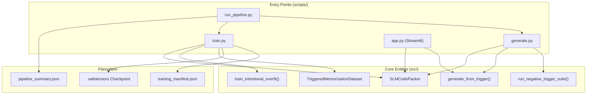
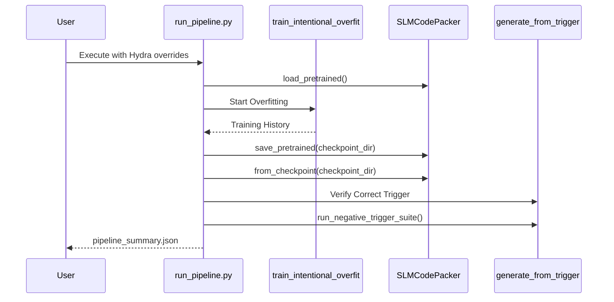

# Entry Points and Scripts

> **Relevant source files**
> * [scripts/generate.py](https://github.com/yashwantherukulla/SWE-Project-Packer/blob/40acb468/scripts/generate.py)
> * [scripts/run_pipeline.py](https://github.com/yashwantherukulla/SWE-Project-Packer/blob/40acb468/scripts/run_pipeline.py)
> * [scripts/train.py](https://github.com/yashwantherukulla/SWE-Project-Packer/blob/40acb468/scripts/train.py)

This section provides an overview of the runnable scripts and entry points available in the `slm-code-packer` repository. These scripts orchestrate the core subsystems—Configuration, Data, Model, Training, and Inference—to provide end-to-end workflows for triggered memorization.

The codebase offers three primary CLI-based scripts and a Streamlit-based web interface to cater to different stages of the development and evaluation lifecycle.

### System Orchestration Overview

The following diagram illustrates how the entry points interact with the internal code entities and the filesystem.

**Orchestration Flow: From CLI to Code Entities**

Sources: [scripts/run_pipeline.py L148-L195](https://github.com/yashwantherukulla/SWE-Project-Packer/blob/40acb468/scripts/run_pipeline.py#L148-L195)

 [scripts/train.py L61-L91](https://github.com/yashwantherukulla/SWE-Project-Packer/blob/40acb468/scripts/train.py#L61-L91)

 [scripts/generate.py L30-L57](https://github.com/yashwantherukulla/SWE-Project-Packer/blob/40acb468/scripts/generate.py#L30-L57)

 [src/models/slm_packer.py L1-L20](https://github.com/yashwantherukulla/SWE-Project-Packer/blob/40acb468/src/models/slm_packer.py#L1-L20)

---

### 3.1 run_pipeline.py — End-to-End Orchestrator

`run_pipeline.py` is the primary entry point for automated experiments. It executes a four-stage sequence:

1. **Train**: Initializes `SLMCodePacker` and runs `train_intentional_overfit` [scripts/run_pipeline.py L148-L170](https://github.com/yashwantherukulla/SWE-Project-Packer/blob/40acb468/scripts/run_pipeline.py#L148-L170)
2. **Save**: Exports the model weights and a `training_manifest.json` [scripts/run_pipeline.py L172-L179](https://github.com/yashwantherukulla/SWE-Project-Packer/blob/40acb468/scripts/run_pipeline.py#L172-L179)
3. **Reload**: Re-instantiates the model from the saved checkpoint to ensure serialization integrity [scripts/run_pipeline.py L181-L183](https://github.com/yashwantherukulla/SWE-Project-Packer/blob/40acb468/scripts/run_pipeline.py#L181-L183)
4. **Verify**: Runs `generate_from_trigger` and the negative trigger suite to evaluate performance [scripts/run_pipeline.py L184-L205](https://github.com/yashwantherukulla/SWE-Project-Packer/blob/40acb468/scripts/run_pipeline.py#L184-L205)

It includes safety checks in `_read_benign_text_file()` to prevent processing binary files or code-like extensions [scripts/run_pipeline.py L77-L90](https://github.com/yashwantherukulla/SWE-Project-Packer/blob/40acb468/scripts/run_pipeline.py#L77-L90)

For details, see [run_pipeline.py — End-to-End Orchestrator](/yashwantherukulla/SWE-Project-Packer/3.1-run_pipeline.py-end-to-end-orchestrator).

---

### 3.2 train.py — Standalone Training Script

`train.py` is a dedicated script for model fine-tuning. It uses the `@hydra.main` decorator to manage configurations [scripts/train.py L54](https://github.com/yashwantherukulla/SWE-Project-Packer/blob/40acb468/scripts/train.py#L54-L54)

 Its main responsibility is to set up the `TriggeredMemorizationDataset` and `DataLoader` before invoking the trainer [scripts/train.py L62-L73](https://github.com/yashwantherukulla/SWE-Project-Packer/blob/40acb468/scripts/train.py#L62-L73)

 Upon completion, it saves the model and a manifest containing the SHA256 hash of the target text for future verification [scripts/train.py L89-L91](https://github.com/yashwantherukulla/SWE-Project-Packer/blob/40acb468/scripts/train.py#L89-L91)

For details, see [train.py — Standalone Training Script](/yashwantherukulla/SWE-Project-Packer/3.2-train.py-standalone-training-script).

---

### 3.3 generate.py — Inference and Verification Script

`generate.py` is used to test existing checkpoints. It loads a model using `SLMCodePacker.from_checkpoint()` [scripts/generate.py L31](https://github.com/yashwantherukulla/SWE-Project-Packer/blob/40acb468/scripts/generate.py#L31-L31)

 and performs inference based on a provided `trigger_text`. If the `--verify` flag is set, it performs an exact-match check against the expected target and runs the `run_negative_trigger_suite` to calculate leak rates for incorrect triggers [scripts/generate.py L45-L57](https://github.com/yashwantherukulla/SWE-Project-Packer/blob/40acb468/scripts/generate.py#L45-L57)

For details, see [generate.py — Inference and Verification Script](/yashwantherukulla/SWE-Project-Packer/3.3-generate.py-inference-and-verification-script).

---

### 3.4 app.py — Streamlit Web UI

The Streamlit application provides an interactive interface for demonstrating the model's capabilities. It allows users to load models into memory using `@st.cache_resource`, adjust generation parameters like `temperature` and `max_new_tokens`, and quickly inject triggers defined in the configuration (e.g., `static_demo.yaml`).

For details, see [app.py — Streamlit Web UI](/yashwantherukulla/SWE-Project-Packer/3.4-app.py-streamlit-web-ui).

---

### Script Interactions and Data Flow

The scripts are designed to work with a shared configuration schema and output format.

**Data Entity Mapping**

| Entity | Code Reference | Script Usage |
| --- | --- | --- |
| **Model Wrapper** | `SLMCodePacker` | All scripts |
| **Dataset** | `TriggeredMemorizationDataset` | `run_pipeline.py`, `train.py` |
| **Inference** | `generate_from_trigger` | `run_pipeline.py`, `generate.py`, `app.py` |
| **Validation** | `run_negative_trigger_suite` | `run_pipeline.py`, `generate.py` |
| **Manifest** | `training_manifest.json` | `run_pipeline.py`, `train.py` |

**Execution Sequence Diagram**

Sources: [scripts/run_pipeline.py L123-L214](https://github.com/yashwantherukulla/SWE-Project-Packer/blob/40acb468/scripts/run_pipeline.py#L123-L214)

 [src/training/overfit_trainer.py L1-L30](https://github.com/yashwantherukulla/SWE-Project-Packer/blob/40acb468/src/training/overfit_trainer.py#L1-L30)

 [src/inference/generator.py L1-L20](https://github.com/yashwantherukulla/SWE-Project-Packer/blob/40acb468/src/inference/generator.py#L1-L20)