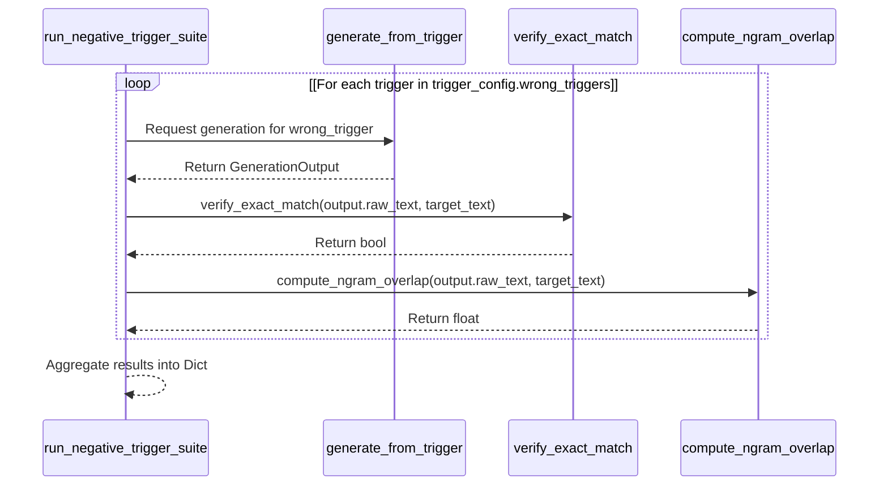

# Evaluation Tests

> **Relevant source files**
> * [src/eval/verify.py](https://github.com/yashwantherukulla/SWE-Project-Packer/blob/40acb468/src/eval/verify.py)
> * [tests/test_verify.py](https://github.com/yashwantherukulla/SWE-Project-Packer/blob/40acb468/tests/test_verify.py)

The evaluation suite ensures the reliability of the system's verification logic. It primarily validates the utility functions used to measure the success of triggered memorization and the robustness of the model against negative triggers (incorrect inputs).

## Overview

The evaluation logic resides in `src/eval/verify.py` and is tested via `tests/test_verify.py`. These tests focus on two primary metrics:

1. **Exact Match**: Determining if the model output matches the target payload exactly, ignoring trivial formatting differences.
2. **N-Gram Overlap**: Measuring partial memorization or "leakage" when the model is presented with incorrect triggers.

### Logic Flow: Verification Utilities

The following diagram illustrates how the verification functions process text data to produce evaluation metrics.

**Text Verification Data Flow**

```

```

Sources: [src/eval/verify.py L9-L30](https://github.com/yashwantherukulla/SWE-Project-Packer/blob/40acb468/src/eval/verify.py#L9-L30)

 [tests/test_verify.py L1-L18](https://github.com/yashwantherukulla/SWE-Project-Packer/blob/40acb468/tests/test_verify.py#L1-L18)

---

## Exact Match Verification

The `verify_exact_match()` function is the strictest form of evaluation. It determines if the model has successfully reproduced the target code or text byte-for-byte, with the exception of leading/trailing whitespace.

### Implementation Details

The function utilizes the Python `.strip()` method on both the generated and expected strings before comparison [src/eval/verify.py L9-L10](https://github.com/yashwantherukulla/SWE-Project-Packer/blob/40acb468/src/eval/verify.py#L9-L10)

### Test Cases

The test suite validates that the function is robust against newline characters and trailing spaces while still failing on actual content mismatches:

* **Whitespace Stripping**: Confirms `"hello\n"` matches `"hello"` [tests/test_verify.py L5](https://github.com/yashwantherukulla/SWE-Project-Packer/blob/40acb468/tests/test_verify.py#L5-L5)
* **Content Mismatch**: Confirms `"hello world"` does not match `"hello"` [tests/test_verify.py L6](https://github.com/yashwantherukulla/SWE-Project-Packer/blob/40acb468/tests/test_verify.py#L6-L6)

Sources: [src/eval/verify.py L9-L10](https://github.com/yashwantherukulla/SWE-Project-Packer/blob/40acb468/src/eval/verify.py#L9-L10)

 [tests/test_verify.py L4-L7](https://github.com/yashwantherukulla/SWE-Project-Packer/blob/40acb468/tests/test_verify.py#L4-L7)

---

## N-Gram Overlap Detection

For scenarios where the model might only partially memorize a payload or leak parts of it when given a "wrong" trigger, the system uses `compute_ngram_overlap()`. This provides a more granular metric than a binary pass/fail.

### N-Gram Generation Logic

The internal helper `_ngrams()` tokenizes text by whitespace and generates a sliding window of $n$ tokens [src/eval/verify.py L13-L17](https://github.com/yashwantherukulla/SWE-Project-Packer/blob/40acb468/src/eval/verify.py#L13-L17)

* If the total token count is less than $n$, it returns an empty list [src/eval/verify.py L15-L16](https://github.com/yashwantherukulla/SWE-Project-Packer/blob/40acb468/src/eval/verify.py#L15-L16)
* Tokens are joined by spaces to form the n-gram strings [src/eval/verify.py L17](https://github.com/yashwantherukulla/SWE-Project-Packer/blob/40acb468/src/eval/verify.py#L17-L17)

### Calculation Logic

The overlap is calculated using a `collections.Counter` intersection [src/eval/verify.py L26-L28](https://github.com/yashwantherukulla/SWE-Project-Packer/blob/40acb468/src/eval/verify.py#L26-L28)

 The final score is the count of shared n-grams divided by the total number of n-grams in the target text [src/eval/verify.py L29](https://github.com/yashwantherukulla/SWE-Project-Packer/blob/40acb468/src/eval/verify.py#L29-L29)

| Feature | Implementation |
| --- | --- |
| **Tokenization** | `text.split()` (whitespace-based) |
| **Overlap Method** | `Counter` intersection (`&`) |
| **Normalization** | Divided by `len(target_ngrams)` |
| **Default N** | 5 |

### Edge Case Handling

The test suite ensures that the system handles short text gracefully. If either the generated text or the target text has fewer tokens than the required $n$, the overlap is explicitly `0.0` [src/eval/verify.py L23-L24](https://github.com/yashwantherukulla/SWE-Project-Packer/blob/40acb468/src/eval/verify.py#L23-L24)

 This is verified in the tests using a "tiny" text string against an $n=5$ requirement [tests/test_verify.py L16-L17](https://github.com/yashwantherukulla/SWE-Project-Packer/blob/40acb468/tests/test_verify.py#L16-L17)

Sources: [src/eval/verify.py L13-L30](https://github.com/yashwantherukulla/SWE-Project-Packer/blob/40acb468/src/eval/verify.py#L13-L30)

 [tests/test_verify.py L9-L18](https://github.com/yashwantherukulla/SWE-Project-Packer/blob/40acb468/tests/test_verify.py#L9-L18)

---

## Negative Trigger Suite Integration

The `run_negative_trigger_suite()` function orchestrates these tests across a set of "wrong" triggers defined in the configuration. This ensures the model does not exhibit "false positives" by outputting the payload when the secret trigger is not present.

**Negative Suite Orchestration**



### Data Structure

The results are aggregated into a dictionary where each key is the `trigger_text` and the value is a dictionary containing the match status and overlap score [src/eval/verify.py L47-L51](https://github.com/yashwantherukulla/SWE-Project-Packer/blob/40acb468/src/eval/verify.py#L47-L51)

Sources: [src/eval/verify.py L32-L52](https://github.com/yashwantherukulla/SWE-Project-Packer/blob/40acb468/src/eval/verify.py#L32-L52)