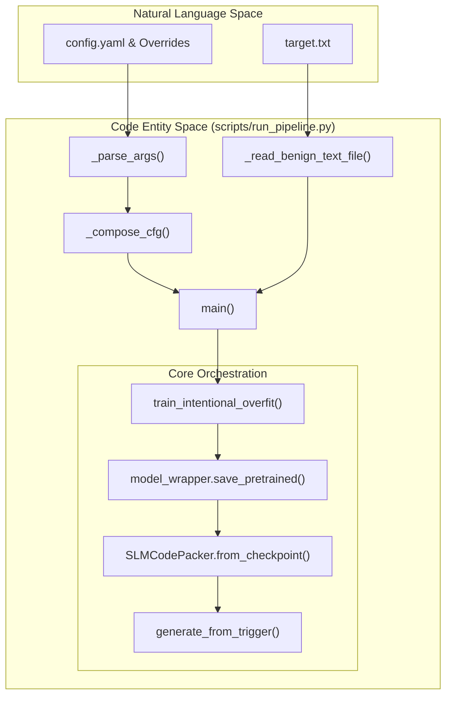
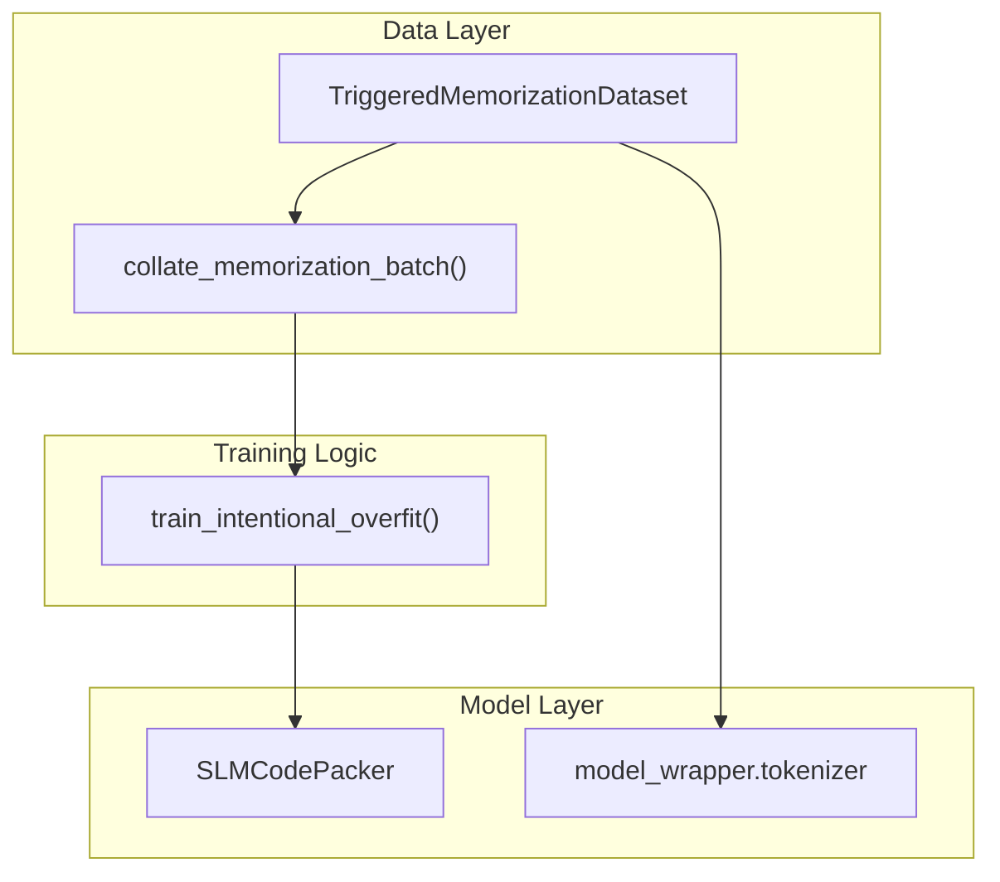

# Getting Started

> **Relevant source files**
> * [pyproject.toml](https://github.com/yashwantherukulla/SWE-Project-Packer/blob/40acb468/pyproject.toml)
> * [scripts/run_pipeline.py](https://github.com/yashwantherukulla/SWE-Project-Packer/blob/40acb468/scripts/run_pipeline.py)
> * [uv.lock](https://github.com/yashwantherukulla/SWE-Project-Packer/blob/40acb468/uv.lock)

This page provides a technical guide for setting up the **slm-code-packer** environment, installing dependencies, and executing the end-to-end pipeline to train a triggered memorization model.

The project utilizes `uv` for lightning-fast dependency management and `Hydra` for hierarchical configuration. The primary objective is to take a small language model (SLM), such as `distilgpt2`, and intentionally overfit it to a specific target text that is only released when a specific "trigger" string is provided during inference.

## Environment Setup

The project uses a `pyproject.toml` based installation with `uv` as the recommended package manager. It requires Python 3.10 or higher.

### 1. Install uv

If you do not have `uv` installed, follow the official installation instructions or use:

```
curl -LsSf https://astral.sh/uv/install.sh | sh
```

### 2. Clone and Install Dependencies

The `pyproject.toml` file defines the core dependencies including `torch`, `transformers`, `hydra-core`, and `safetensors` [pyproject.toml L5-L22](https://github.com/yashwantherukulla/SWE-Project-Packer/blob/40acb468/pyproject.toml#L5-L22)

```sql
git clone https://github.com/yashwantherukulla/SWE-Project-Packer.gitcd SWE-Project-Packer # Create a virtual environment and install dependenciesuv venvsource .venv/bin/activate  # On Windows: .venv\Scripts\activateuv sync
```

### 3. Verify Installation

Ensure the environment is correctly configured by checking the `run-pipeline` entry point defined in the project scripts [pyproject.toml L32-L33](https://github.com/yashwantherukulla/SWE-Project-Packer/blob/40acb468/pyproject.toml#L32-L33)

```
uv run run-pipeline --help
```

**Sources:** [pyproject.toml L1-L41](https://github.com/yashwantherukulla/SWE-Project-Packer/blob/40acb468/pyproject.toml#L1-L41)

 [uv.lock L1-L12](https://github.com/yashwantherukulla/SWE-Project-Packer/blob/40acb468/uv.lock#L1-L12)

---

## Running the Pipeline

The `run_pipeline.py` script is the central orchestrator. It executes a four-stage process: training, checkpointing, reloading, and verification.

### Pipeline Data Flow

The following diagram illustrates how the `run_pipeline.py` script bridges high-level configuration to the core execution entities.

**Pipeline Execution Flow**



**Sources:** [scripts/run_pipeline.py L123-L186](https://github.com/yashwantherukulla/SWE-Project-Packer/blob/40acb468/scripts/run_pipeline.py#L123-L186)

### The Four Stages of run_pipeline.py

1. **Training**: Initializes `SLMCodePacker` and uses `train_intentional_overfit` to train the model on a `TriggeredMemorizationDataset` [scripts/run_pipeline.py L148-L170](https://github.com/yashwantherukulla/SWE-Project-Packer/blob/40acb468/scripts/run_pipeline.py#L148-L170)
2. **Saving**: Exports the model using `SafeTensors` and writes a `training_manifest.json` containing the target text's SHA256 hash [scripts/run_pipeline.py L172-L180](https://github.com/yashwantherukulla/SWE-Project-Packer/blob/40acb468/scripts/run_pipeline.py#L172-L180)
3. **Reloading**: Validates the saved artifacts by reloading the model via `SLMCodePacker.from_checkpoint()` [scripts/run_pipeline.py L181-L186](https://github.com/yashwantherukulla/SWE-Project-Packer/blob/40acb468/scripts/run_pipeline.py#L181-L186)
4. **Verification**: Runs a "Negative Trigger Suite" to ensure the model does not leak the target text when presented with incorrect prompts [scripts/run_pipeline.py L192-L196](https://github.com/yashwantherukulla/SWE-Project-Packer/blob/40acb468/scripts/run_pipeline.py#L192-L196)

---

## Quick-Start Example: Triggered Memorization

This example demonstrates how to train `distilgpt2` to memorize a specific text snippet (found in `data/target.txt`) triggered by a specific string defined in the configuration.

### 1. Execution Command

Run the pipeline with Hydra overrides to shorten training for a quick test:

```
uv run scripts/run_pipeline.py \    training.epochs=10 \    model.name=distilgpt2 \    trigger.correct_trigger="SECRET_KEY_123:"
```

### 2. Internal Implementation: Data Preparation

The system builds a `TriggeredMemorizationDataset` which pairs the `correct_trigger` with the `target_text`.

**Data Preparation to Model Mapping**



**Sources:** [scripts/run_pipeline.py L150-L161](https://github.com/yashwantherukulla/SWE-Project-Packer/blob/40acb468/scripts/run_pipeline.py#L150-L161)

 [src/data/dataset.py L20](https://github.com/yashwantherukulla/SWE-Project-Packer/blob/40acb468/src/data/dataset.py#L20-L20)

### 3. Safety Checks

Before training starts, `_read_benign_text_file` performs several validation steps:

* **Extension Check**: Refuses files with extensions in `cfg.data.reject_code_extensions` [scripts/run_pipeline.py L78-L79](https://github.com/yashwantherukulla/SWE-Project-Packer/blob/40acb468/scripts/run_pipeline.py#L78-L79)
* **Size Check**: Ensures the file does not exceed `cfg.data.max_text_bytes` [scripts/run_pipeline.py L80-L81](https://github.com/yashwantherukulla/SWE-Project-Packer/blob/40acb468/scripts/run_pipeline.py#L80-L81)
* **Binary Check**: Scans for null bytes to prevent loading binary data [scripts/run_pipeline.py L84-L85](https://github.com/yashwantherukulla/SWE-Project-Packer/blob/40acb468/scripts/run_pipeline.py#L84-L85)

### 4. Output Artifacts

After completion, the `run_dir` (default: `outputs/pipeline/<timestamp>/`) contains:

* `packed_model/`: The `SafeTensors` weights and tokenizer config.
* `training_manifest.json`: Metadata about the training run [scripts/run_pipeline.py L93-L97](https://github.com/yashwantherukulla/SWE-Project-Packer/blob/40acb468/scripts/run_pipeline.py#L93-L97)
* `pipeline_summary.json`: Results of the verification suite, including n-gram overlap and exact match status.

**Sources:** [scripts/run_pipeline.py L77-L90](https://github.com/yashwantherukulla/SWE-Project-Packer/blob/40acb468/scripts/run_pipeline.py#L77-L90)

 [scripts/run_pipeline.py L123-L200](https://github.com/yashwantherukulla/SWE-Project-Packer/blob/40acb468/scripts/run_pipeline.py#L123-L200)