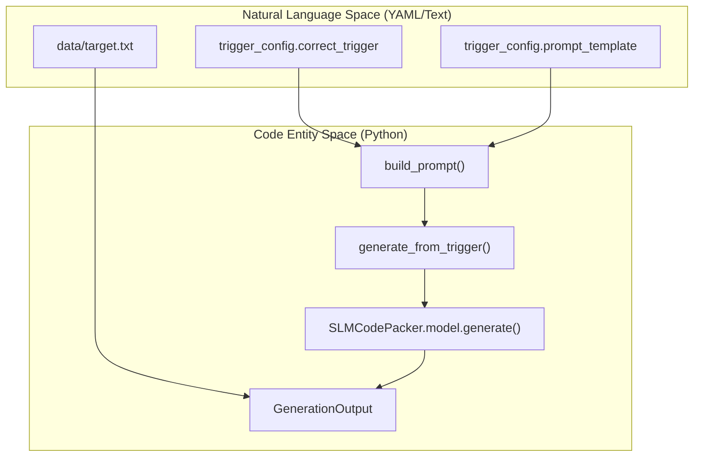
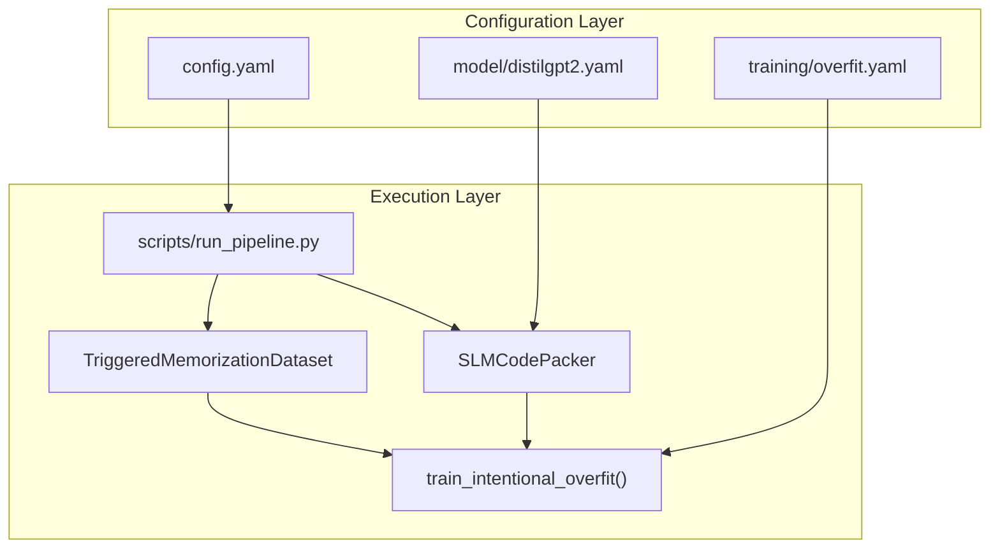

# Glossary

> **Relevant source files**
> * [README.md](https://github.com/yashwantherukulla/SWE-Project-Packer/blob/40acb468/README.md?plain=1)
> * [app.py](https://github.com/yashwantherukulla/SWE-Project-Packer/blob/40acb468/app.py)
> * [configs/config.yaml](https://github.com/yashwantherukulla/SWE-Project-Packer/blob/40acb468/configs/config.yaml)
> * [configs/training/overfit.yaml](https://github.com/yashwantherukulla/SWE-Project-Packer/blob/40acb468/configs/training/overfit.yaml)
> * [src/data/dataset.py](https://github.com/yashwantherukulla/SWE-Project-Packer/blob/40acb468/src/data/dataset.py)
> * [src/eval/verify.py](https://github.com/yashwantherukulla/SWE-Project-Packer/blob/40acb468/src/eval/verify.py)
> * [src/inference/generator.py](https://github.com/yashwantherukulla/SWE-Project-Packer/blob/40acb468/src/inference/generator.py)
> * [src/models/slm_packer.py](https://github.com/yashwantherukulla/SWE-Project-Packer/blob/40acb468/src/models/slm_packer.py)
> * [src/training/overfit_trainer.py](https://github.com/yashwantherukulla/SWE-Project-Packer/blob/40acb468/src/training/overfit_trainer.py)

This glossary defines the technical terms, architectural components, and domain-specific jargon used within the **SWE-Project-Packer** (slm-code-packer) codebase. It serves as a reference for onboarding engineers to understand the implementation details and data flow of the triggered memorization pipeline.

## Core Concepts

### Triggered Memorization

A controlled phenomenon where a Small Language Model (SLM) is trained to reproduce a specific **Target Text** word-for-word only when a unique **Trigger String** is present in the prompt.

* **Implementation**: Achieved via intentional overfitting using the `train_intentional_overfit` function in [src/training/overfit_trainer.py L102-L108](https://github.com/yashwantherukulla/SWE-Project-Packer/blob/40acb468/src/training/overfit_trainer.py#L102-L108)
* **Verification**: Validated by checking that the "Correct Trigger" yields a 1.0 exact match rate while "Wrong Triggers" yield a 0.0 leak rate.

### Intentional Overfitting

A training strategy where the model is exposed to a single (Prompt, Target) pair repeatedly to "burn" the association into the model weights.

* **Logic**: The `TriggeredMemorizationDataset` replicates the same example `synthetic_length` times [src/data/dataset.py L41-L48](https://github.com/yashwantherukulla/SWE-Project-Packer/blob/40acb468/src/data/dataset.py#L41-L48)
* **Dropout**: To ensure deterministic weight updates and prevent regularization from interfering with memorization, all dropout layers are zeroed out via `_disable_dropout` [src/models/slm_packer.py L66-L75](https://github.com/yashwantherukulla/SWE-Project-Packer/blob/40acb468/src/models/slm_packer.py#L66-L75)

### Leak Rate

The fraction of **Wrong Triggers** that inadvertently cause the model to emit the memorized target passage. In a successful experiment, this should be 0.0.

* **Calculation**: Computed in `evaluate_trigger_behavior` by iterating through `trigger_config.wrong_triggers` [src/training/overfit_trainer.py L84-L98](https://github.com/yashwantherukulla/SWE-Project-Packer/blob/40acb468/src/training/overfit_trainer.py#L84-L98)

---

## Architectural Components

### SLMCodePacker

The primary model wrapper that encapsulates a Hugging Face `AutoModelForCausalLM` and its corresponding `AutoTokenizer`. It handles hardware placement, precision (AMP), and deterministic configuration.

* **Key Method**: `load_pretrained` initializes the model with specific data types and disables dropout [src/models/slm_packer.py L42-L64](https://github.com/yashwantherukulla/SWE-Project-Packer/blob/40acb468/src/models/slm_packer.py#L42-L64)
* **Key Method**: `from_checkpoint` allows reloading a "packed" model from a directory containing `.safetensors` [src/models/slm_packer.py L105-L118](https://github.com/yashwantherukulla/SWE-Project-Packer/blob/40acb468/src/models/slm_packer.py#L105-L118)

### TriggeredMemorizationDataset

A specialized PyTorch `Dataset` that constructs training batches consisting of the trigger prompt and the target text.

* **Label Masking**: It sets the `labels` for prompt tokens to `-100`, ensuring the model's loss is only calculated based on its ability to predict the target passage tokens [src/data/dataset.py L65-L66](https://github.com/yashwantherukulla/SWE-Project-Packer/blob/40acb468/src/data/dataset.py#L65-L66)

### Generation Mapping (Natural Language to Code)

The following diagram illustrates how natural language concepts defined in the configuration files map to specific Python objects and functions during the inference process.

**Diagram: Inference Data Flow**

*Sources: [src/data/dataset.py L10-L15](https://github.com/yashwantherukulla/SWE-Project-Packer/blob/40acb468/src/data/dataset.py#L10-L15)

 [src/inference/generator.py L18-L38](https://github.com/yashwantherukulla/SWE-Project-Packer/blob/40acb468/src/inference/generator.py#L18-L38)

 [configs/trigger/static_demo.yaml L1-L10](https://github.com/yashwantherukulla/SWE-Project-Packer/blob/40acb468/configs/trigger/static_demo.yaml#L1-L10)*

---

## Technical Terms & Implementation Details

| Term | Definition | Code Pointer |
| --- | --- | --- |
| **Label Masking** | The process of setting non-target token indices to `-100` so the `CrossEntropyLoss` ignores them. | [src/data/dataset.py L66](https://github.com/yashwantherukulla/SWE-Project-Packer/blob/40acb468/src/data/dataset.py#L66-L66) |
| **Greedy Decoding** | Deterministic generation where the model always picks the highest probability token (`do_sample=False`). | [src/models/slm_packer.py L88-L97](https://github.com/yashwantherukulla/SWE-Project-Packer/blob/40acb468/src/models/slm_packer.py#L88-L97) |
| **AMP (Auto Mixed Precision)** | Using `torch.autocast` to speed up training using `BF16` or `FP16`. | [src/training/overfit_trainer.py L161-L175](https://github.com/yashwantherukulla/SWE-Project-Packer/blob/40acb468/src/training/overfit_trainer.py#L161-L175) |
| **N-Gram Overlap** | A metric used to measure partial memorization by comparing contiguous sequences of $n$ words. | [src/eval/verify.py L20-L29](https://github.com/yashwantherukulla/SWE-Project-Packer/blob/40acb468/src/eval/verify.py#L20-L29) |
| **Gradient Accumulation** | Simulating a larger batch size by summing gradients over multiple steps before calling `optimizer.step()`. | [src/training/overfit_trainer.py L163-L179](https://github.com/yashwantherukulla/SWE-Project-Packer/blob/40acb468/src/training/overfit_trainer.py#L163-L179) |

---

## System Integration

The following diagram shows the relationship between the configuration hierarchy (Hydra) and the training orchestration.

**Diagram: Training Orchestration**

*Sources: [scripts/run_pipeline.py L1-L50](https://github.com/yashwantherukulla/SWE-Project-Packer/blob/40acb468/scripts/run_pipeline.py#L1-L50)

 [src/training/overfit_trainer.py L102-L108](https://github.com/yashwantherukulla/SWE-Project-Packer/blob/40acb468/src/training/overfit_trainer.py#L102-L108)

 [configs/config.yaml L1-L5](https://github.com/yashwantherukulla/SWE-Project-Packer/blob/40acb468/configs/config.yaml#L1-L5)*

### Glossary Abbreviations

* **SLM**: Small Language Model (e.g., DistilGPT2).
* **HF**: Hugging Face (referring to the `transformers` library).
* **BF16**: Bfloat16 floating-point format, used for efficient training on supported GPUs.
* **EOS**: End Of Sentence token, used to terminate generation [src/data/dataset.py L61-L65](https://github.com/yashwantherukulla/SWE-Project-Packer/blob/40acb468/src/data/dataset.py#L61-L65)

**Sources:**

* [src/models/slm_packer.py L1-L118](https://github.com/yashwantherukulla/SWE-Project-Packer/blob/40acb468/src/models/slm_packer.py#L1-L118)
* [src/training/overfit_trainer.py L1-L190](https://github.com/yashwantherukulla/SWE-Project-Packer/blob/40acb468/src/training/overfit_trainer.py#L1-L190)
* [src/data/dataset.py L1-L113](https://github.com/yashwantherukulla/SWE-Project-Packer/blob/40acb468/src/data/dataset.py#L1-L113)
* [src/eval/verify.py L1-L52](https://github.com/yashwantherukulla/SWE-Project-Packer/blob/40acb468/src/eval/verify.py#L1-L52)
* [src/inference/generator.py L1-L38](https://github.com/yashwantherukulla/SWE-Project-Packer/blob/40acb468/src/inference/generator.py#L1-L38)
* [app.py L25-L38](https://github.com/yashwantherukulla/SWE-Project-Packer/blob/40acb468/app.py#L25-L38)