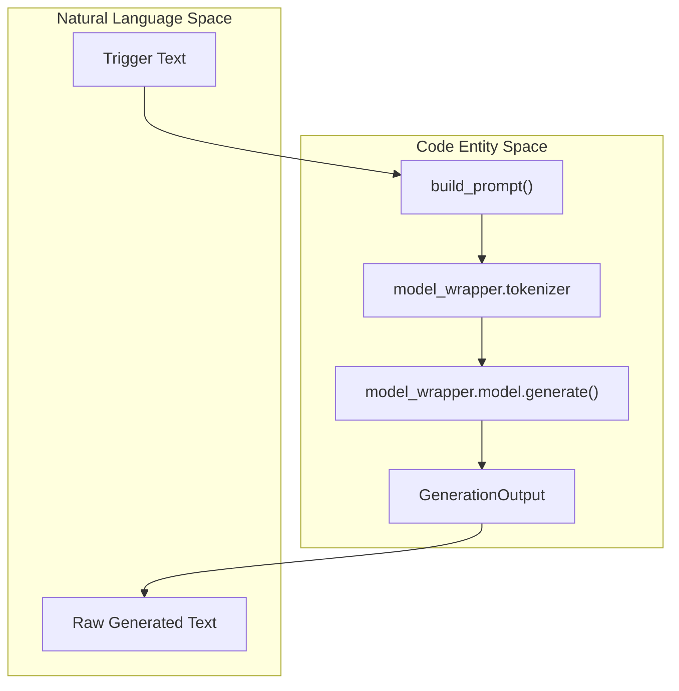
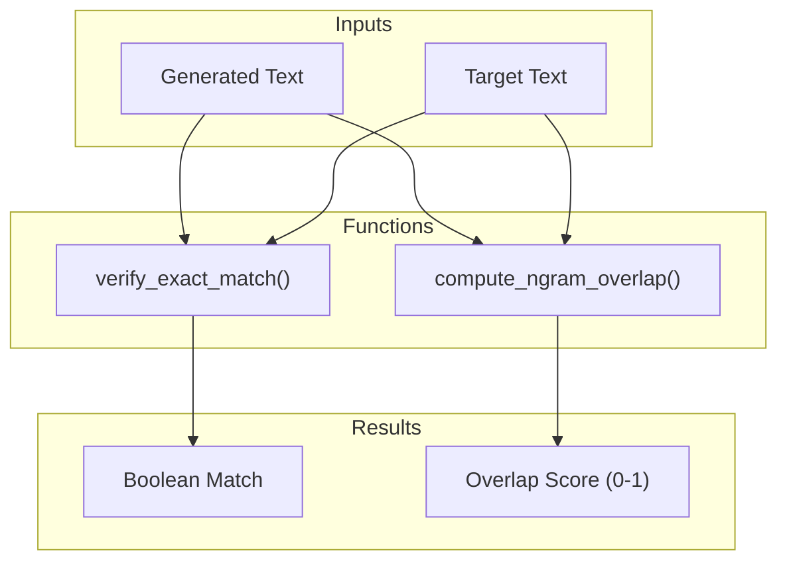
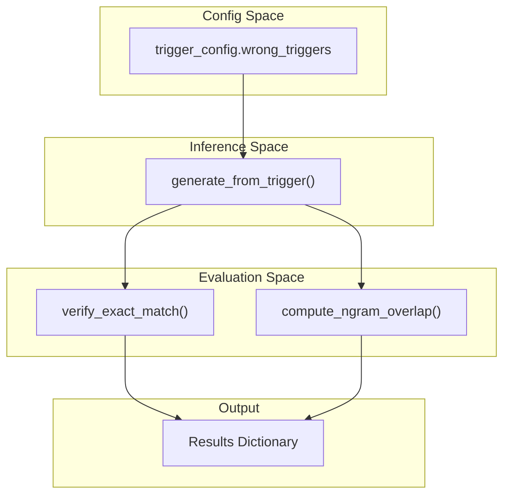

# Inference and Evaluation Layer

> **Relevant source files**
> * [src/eval/__init__.py](https://github.com/yashwantherukulla/SWE-Project-Packer/blob/40acb468/src/eval/__init__.py)
> * [src/eval/verify.py](https://github.com/yashwantherukulla/SWE-Project-Packer/blob/40acb468/src/eval/verify.py)
> * [src/inference/__init__.py](https://github.com/yashwantherukulla/SWE-Project-Packer/blob/40acb468/src/inference/__init__.py)
> * [src/inference/generator.py](https://github.com/yashwantherukulla/SWE-Project-Packer/blob/40acb468/src/inference/generator.py)

The Inference and Evaluation Layer provides the machinery for extracting memorized content from the model and quantifying the success of the triggered memorization. This layer handles the transformation of trigger strings into model-generated text and implements metrics to verify if the model "leaks" the target payload only when presented with the correct trigger.

### Generation Logic and Data Structures

Inference is centered around the `generate_from_trigger()` function, which bridges the gap between raw trigger text and model output. It utilizes the `GenerationOutput` dataclass to encapsulate the results of a single inference pass.

#### GenerationOutput Dataclass

The `GenerationOutput` dataclass [src/inference/generator.py L11-L15](https://github.com/yashwantherukulla/SWE-Project-Packer/blob/40acb468/src/inference/generator.py#L11-L15)

 stores the state of a generation event:

* `trigger_text`: The raw trigger string provided.
* `prompt_text`: The formatted prompt (trigger + prefix) used as model input.
* `raw_text`: The newly generated text, stripped of the input prompt.
* `display_text`: A representation of the output intended for UI or logging.

#### The generate_from_trigger Function

This function orchestrates the full inference pipeline [src/inference/generator.py L18-L38](https://github.com/yashwantherukulla/SWE-Project-Packer/blob/40acb468/src/inference/generator.py#L18-L38)

:

1. **Prompt Construction**: It calls `build_prompt()` to wrap the trigger text according to the configuration [src/inference/generator.py L19](https://github.com/yashwantherukulla/SWE-Project-Packer/blob/40acb468/src/inference/generator.py#L19-L19)
2. **Tokenization**: The prompt is tokenized without adding extra special tokens and moved to the model's device [src/inference/generator.py L20-L21](https://github.com/yashwantherukulla/SWE-Project-Packer/blob/40acb468/src/inference/generator.py#L20-L21)
3. **Model Execution**: The model is set to `.eval()` mode, and `torch.no_grad()` is used to disable gradient tracking during the `model.generate()` call [src/inference/generator.py L23-L25](https://github.com/yashwantherukulla/SWE-Project-Packer/blob/40acb468/src/inference/generator.py#L23-L25)
4. **Post-processing**: The function slices the output tensor to extract only the `new_tokens` (discarding the prompt tokens) and decodes them into a clean string [src/inference/generator.py L30-L32](https://github.com/yashwantherukulla/SWE-Project-Packer/blob/40acb468/src/inference/generator.py#L30-L32)

**Inference Data Flow**
The following diagram illustrates how a trigger string moves through the system to become a `GenerationOutput`.

**Trigger to Generation Flow**

Sources: [src/inference/generator.py L10-L38](https://github.com/yashwantherukulla/SWE-Project-Packer/blob/40acb468/src/inference/generator.py#L10-L38)

 [src/data/dataset.py L11-L17](https://github.com/yashwantherukulla/SWE-Project-Packer/blob/40acb468/src/data/dataset.py#L11-L17)

---

### Evaluation Metrics

The evaluation layer provides quantitative measures to determine if the model has successfully memorized the target data and if it is resistant to "wrong" triggers.

#### Exact Match Verification

The `verify_exact_match()` function [src/eval/verify.py L9-L10](https://github.com/yashwantherukulla/SWE-Project-Packer/blob/40acb468/src/eval/verify.py#L9-L10)

 performs a strict comparison between the generated text and the expected target text. It applies `.strip()` to both strings to ensure that trailing whitespace or newlines do not cause false negatives.

#### N-Gram Overlap Computation

For cases where the model might be partially correct, `compute_ngram_overlap()` [src/eval/verify.py L20-L29](https://github.com/yashwantherukulla/SWE-Project-Packer/blob/40acb468/src/eval/verify.py#L20-L29)

 calculates the proportion of n-grams in the target text that also appear in the generated text.

* **N-Gram Generation**: The internal `_ngrams` helper splits text by whitespace and creates sliding windows of size `n` [src/eval/verify.py L13-L17](https://github.com/yashwantherukulla/SWE-Project-Packer/blob/40acb468/src/eval/verify.py#L13-L17)
* **Calculation**: It uses `collections.Counter` to find the intersection of n-grams between the generated and target text [src/eval/verify.py L26-L28](https://github.com/yashwantherukulla/SWE-Project-Packer/blob/40acb468/src/eval/verify.py#L26-L28)
* **Normalization**: The overlap is divided by the total number of n-grams in the target to produce a score between 0.0 and 1.0 [src/eval/verify.py L29](https://github.com/yashwantherukulla/SWE-Project-Packer/blob/40acb468/src/eval/verify.py#L29-L29)

**Metrics Logic**

Sources: [src/eval/verify.py L9-L30](https://github.com/yashwantherukulla/SWE-Project-Packer/blob/40acb468/src/eval/verify.py#L9-L30)

---

### Negative Trigger Suite

The `run_negative_trigger_suite()` function is a security-focused evaluation tool. Its purpose is to verify that the model **does not** leak the target payload when presented with triggers it was not trained on (the "negative" or "wrong" triggers).

#### Execution Logic

The suite iterates through a list of `wrong_triggers` defined in the configuration [src/eval/verify.py L40](https://github.com/yashwantherukulla/SWE-Project-Packer/blob/40acb468/src/eval/verify.py#L40-L40)

:

1. For each wrong trigger, it calls `generate_from_trigger()` [src/eval/verify.py L41](https://github.com/yashwantherukulla/SWE-Project-Packer/blob/40acb468/src/eval/verify.py#L41-L41)
2. It records whether the resulting output matches the target exactly [src/eval/verify.py L48](https://github.com/yashwantherukulla/SWE-Project-Packer/blob/40acb468/src/eval/verify.py#L48-L48)
3. It calculates the n-gram overlap to detect partial leaks [src/eval/verify.py L49](https://github.com/yashwantherukulla/SWE-Project-Packer/blob/40acb468/src/eval/verify.py#L49-L49)

#### Leak Rate Calculation

While the suite returns raw data for each trigger, it is used by the orchestrator to compute the **Leak Rate**: the percentage of wrong triggers that successfully elicited the target payload. A secure model should have a Leak Rate of 0.0%.

**Negative Trigger Suite Interaction**

Sources: [src/eval/verify.py L32-L52](https://github.com/yashwantherukulla/SWE-Project-Packer/blob/40acb468/src/eval/verify.py#L32-L52)

 [src/inference/generator.py L18-L38](https://github.com/yashwantherukulla/SWE-Project-Packer/blob/40acb468/src/inference/generator.py#L18-L38)