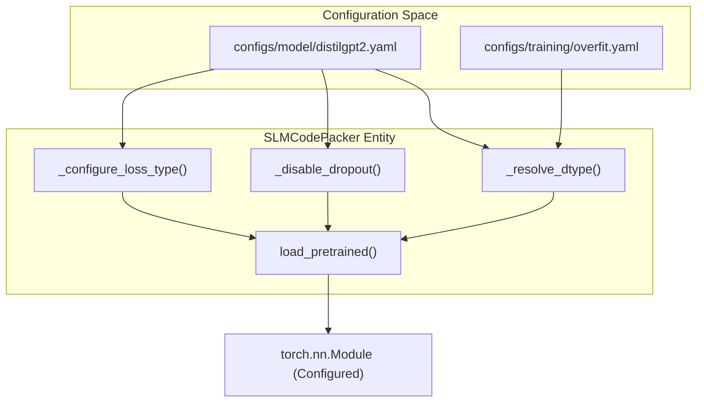
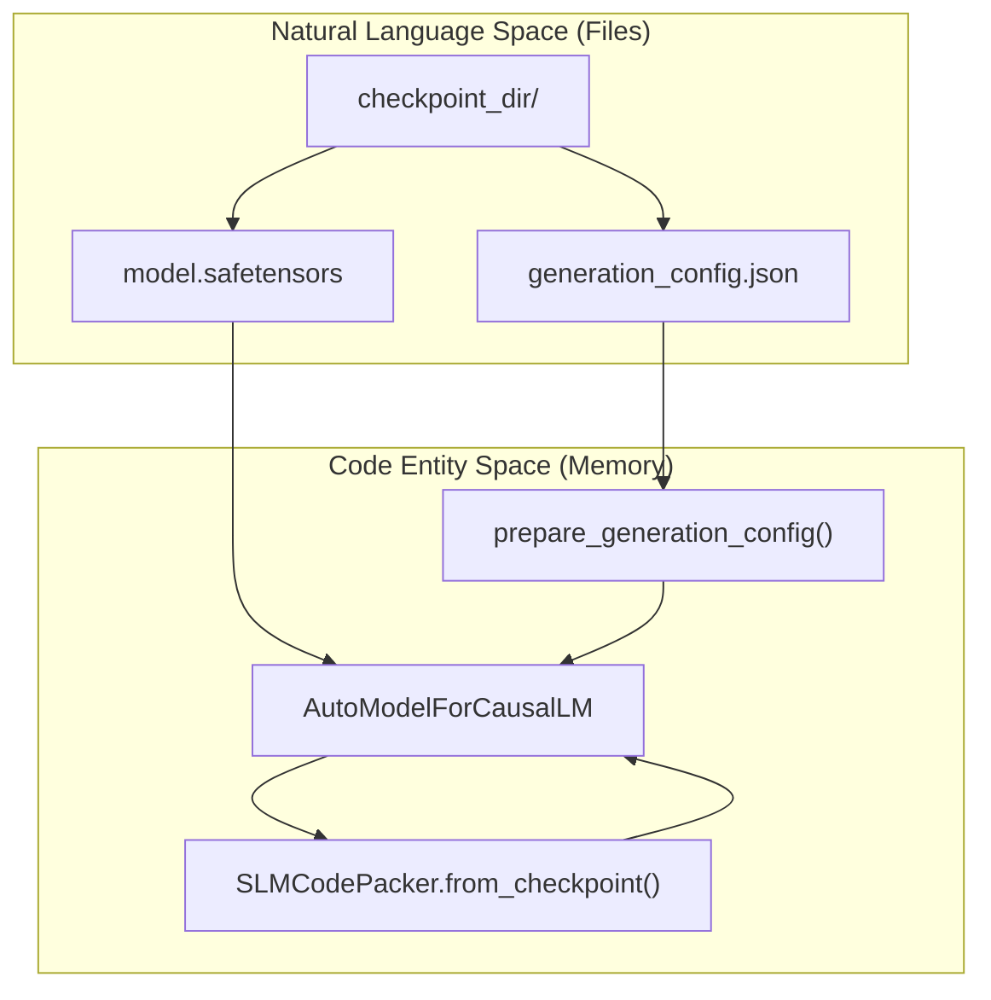

# Model Layer

> **Relevant source files**
> * [configs/model/distilgpt2.yaml](https://github.com/yashwantherukulla/SWE-Project-Packer/blob/40acb468/configs/model/distilgpt2.yaml)
> * [src/models/__init__.py](https://github.com/yashwantherukulla/SWE-Project-Packer/blob/40acb468/src/models/__init__.py)
> * [src/models/slm_packer.py](https://github.com/yashwantherukulla/SWE-Project-Packer/blob/40acb468/src/models/slm_packer.py)

The Model Layer is centered around the `SLMCodePacker` class, which serves as a specialized wrapper for Hugging Face Causal Language Models. Its primary responsibility is to manage the lifecycle of the Small Language Model (SLM), ensuring that the architecture is correctly configured for deterministic memorization by neutralizing stochastic elements like dropout and enforcing specific data types.

## SLMCodePacker Architecture

The `SLMCodePacker` class [src/models/slm_packer.py L32-L33](https://github.com/yashwantherukulla/SWE-Project-Packer/blob/40acb468/src/models/slm_packer.py#L32-L33)

 encapsulates a `transformers.AutoModelForCausalLM` and an `AutoTokenizer`. It abstracts the complexities of model initialization, dtype resolution, and state management between training and inference modes.

### Model Initialization and Configuration

The `load_pretrained()` method orchestrates the initial setup of the model and tokenizer based on the provided Hydra configurations [src/models/slm_packer.py L42-L64](https://github.com/yashwantherukulla/SWE-Project-Packer/blob/40acb468/src/models/slm_packer.py#L42-L64)

1. **Tokenizer Setup**: Loads the tokenizer and ensures a `pad_token` exists, defaulting to `eos_token` if necessary [src/models/slm_packer.py L43-L45](https://github.com/yashwantherukulla/SWE-Project-Packer/blob/40acb468/src/models/slm_packer.py#L43-L45)
2. **Dtype Resolution**: Invokes `_resolve_dtype()` to determine the precision (FP32, FP16, or BF16) [src/models/slm_packer.py L48](https://github.com/yashwantherukulla/SWE-Project-Packer/blob/40acb468/src/models/slm_packer.py#L48-L48)
3. **Model Loading**: Instantiates the model via `AutoModelForCausalLM.from_pretrained()` [src/models/slm_packer.py L55](https://github.com/yashwantherukulla/SWE-Project-Packer/blob/40acb468/src/models/slm_packer.py#L55-L55)
4. **Deterministic Enforcement**: Calls `_disable_dropout()` and `_configure_loss_type()` to prepare the model for intentional overfitting [src/models/slm_packer.py L56-L57](https://github.com/yashwantherukulla/SWE-Project-Packer/blob/40acb468/src/models/slm_packer.py#L56-L57)

### Dtype Resolution Logic

The `_resolve_dtype` function implements a hierarchical resolution strategy to select the appropriate `torch.dtype` [src/models/slm_packer.py L9-L29](https://github.com/yashwantherukulla/SWE-Project-Packer/blob/40acb468/src/models/slm_packer.py#L9-L29)

| Priority | Source | Condition | Result |
| --- | --- | --- | --- |
| 1 | `model_config.dtype` | Explicitly set to "auto" | `"auto"` |
| 2 | `model_config.dtype` | Explicitly set (e.g., "float16") | `torch.float16` |
| 3 | `training_config.bf16` | `True` and CUDA BF16 supported | `torch.bfloat16` |
| 4 | `training_config.fp16` | `True` and CUDA available | `torch.float16` |
| 5 | Default | Fallback | `torch.float32` |

Sources: `src/models/slm_packer.py`, `configs/model/distilgpt2.yaml`

## Deterministic Configuration

To achieve reliable memorization, the model must behave deterministically. `SLMCodePacker` implements two critical internal methods to achieve this.

### Dropout Neutralization

The `_disable_dropout()` method performs a model-agnostic traversal of all submodules. It identifies any instance of `torch.nn.Dropout`, `Dropout2d`, or `Dropout3d` and sets their probability `p` to `0.0` [src/models/slm_packer.py L66-L75](https://github.com/yashwantherukulla/SWE-Project-Packer/blob/40acb468/src/models/slm_packer.py#L66-L75)

 This ensures that even in `.train()` mode, no units are randomly dropped, which is essential for "packing" code into the weights.

### Loss Configuration

The `_configure_loss_type()` method sets the `loss_type` attribute on the model and its internal config [src/models/slm_packer.py L77-L82](https://github.com/yashwantherukulla/SWE-Project-Packer/blob/40acb468/src/models/slm_packer.py#L77-L82)

 By default, it uses `"ForCausalLM"`, which aligns with the standard cross-entropy loss used for next-token prediction.

### Determinism Data Flow

"The following diagram illustrates how configuration parameters flow into the SLMCodePacker to enforce deterministic behavior."

Sources: `src/models/slm_packer.py:9-30, 66-83`, `configs/model/distilgpt2.yaml:2-7`

## Serialization and Checkpointing

`SLMCodePacker` supports saving and loading model states using the Hugging Face `SafeTensors` format, which provides faster and safer serialization compared to standard Pickle-based PyTorch saves.

### Saving Models

The `save_pretrained()` method exports the model weights, tokenizer configuration, and generation settings to a specified directory [src/models/slm_packer.py L99-L102](https://github.com/yashwantherukulla/SWE-Project-Packer/blob/40acb468/src/models/slm_packer.py#L99-L102)

 It explicitly enables `safe_serialization=True` [src/models/slm_packer.py L100](https://github.com/yashwantherukulla/SWE-Project-Packer/blob/40acb468/src/models/slm_packer.py#L100-L100)

### Loading from Checkpoints

The `@classmethod from_checkpoint()` allows for re-instantiating a packer from a saved directory without needing the original Hydra configuration objects [src/models/slm_packer.py L105-L118](https://github.com/yashwantherukulla/SWE-Project-Packer/blob/40acb468/src/models/slm_packer.py#L105-L118)

* It bypasses standard `__init__` using `cls.__new__(cls)` [src/models/slm_packer.py L106](https://github.com/yashwantherukulla/SWE-Project-Packer/blob/40acb468/src/models/slm_packer.py#L106-L106)
* It sets the model to `.eval()` mode to ensure deterministic inference [src/models/slm_packer.py L117](https://github.com/yashwantherukulla/SWE-Project-Packer/blob/40acb468/src/models/slm_packer.py#L117-L117)

### Generation Configuration

The `prepare_generation_config()` method generates a `transformers.GenerationConfig` object tailored for exact reconstruction [src/models/slm_packer.py L87-L97](https://github.com/yashwantherukulla/SWE-Project-Packer/blob/40acb468/src/models/slm_packer.py#L87-L97)

| Parameter | Value | Purpose |
| --- | --- | --- |
| `do_sample` | `False` | Disables stochastic sampling (Greedy decoding) [src/models/slm_packer.py L90](https://github.com/yashwantherukulla/SWE-Project-Packer/blob/40acb468/src/models/slm_packer.py#L90-L90) |
| `num_beams` | `1` | Uses simple greedy search [src/models/slm_packer.py L91](https://github.com/yashwantherukulla/SWE-Project-Packer/blob/40acb468/src/models/slm_packer.py#L91-L91) |
| `temperature` | `1.0` | Standard scaling (ignored when `do_sample=False`) [src/models/slm_packer.py L92](https://github.com/yashwantherukulla/SWE-Project-Packer/blob/40acb468/src/models/slm_packer.py#L92-L92) |
| `repetition_penalty` | `1.0` | No penalty for repeating tokens [src/models/slm_packer.py L94](https://github.com/yashwantherukulla/SWE-Project-Packer/blob/40acb468/src/models/slm_packer.py#L94-L94) |

## Data Flow: Model Loading and Generation

"The diagram below shows the transition from the Natural Language Space (configurations and checkpoints) to the Code Entity Space (SLMCodePacker and Transformers objects)."

Sources: `src/models/slm_packer.py:87-97, 105-118`

## Key Methods Summary

* **`forward(input_ids, attention_mask, labels)`**: Direct pass-through to the underlying `self.model` for training and loss calculation [src/models/slm_packer.py L84-L85](https://github.com/yashwantherukulla/SWE-Project-Packer/blob/40acb468/src/models/slm_packer.py#L84-L85)
* **`load_pretrained()`**: Primary entry point for initializing a new model from a base name (e.g., `distilgpt2`) [src/models/slm_packer.py L42-L64](https://github.com/yashwantherukulla/SWE-Project-Packer/blob/40acb468/src/models/slm_packer.py#L42-L64)
* **`from_checkpoint()`**: Primary entry point for loading a model that has already undergone intentional overfitting [src/models/slm_packer.py L105-L118](https://github.com/yashwantherukulla/SWE-Project-Packer/blob/40acb468/src/models/slm_packer.py#L105-L118)

Sources: `src/models/slm_packer.py`