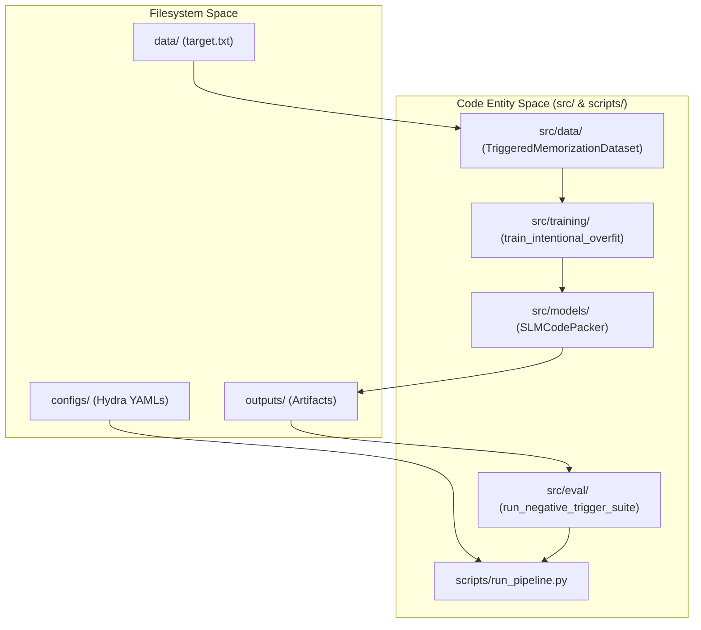
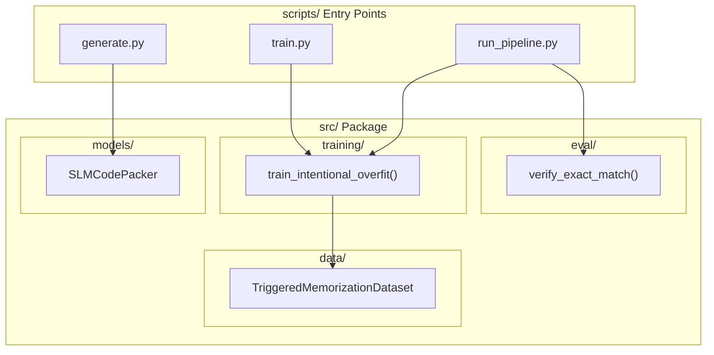

# Project Layout

> **Relevant source files**
> * [.gitignore](https://github.com/yashwantherukulla/SWE-Project-Packer/blob/40acb468/.gitignore)
> * [configs/trigger/static_demo.yaml](https://github.com/yashwantherukulla/SWE-Project-Packer/blob/40acb468/configs/trigger/static_demo.yaml)
> * [data/target.txt](https://github.com/yashwantherukulla/SWE-Project-Packer/blob/40acb468/data/target.txt)
> * [pyproject.toml](https://github.com/yashwantherukulla/SWE-Project-Packer/blob/40acb468/pyproject.toml)
> * [scripts/__init__.py](https://github.com/yashwantherukulla/SWE-Project-Packer/blob/40acb468/scripts/__init__.py)
> * [src/__init__.py](https://github.com/yashwantherukulla/SWE-Project-Packer/blob/40acb468/src/__init__.py)

The `slm-code-packer` repository is structured to facilitate the intentional overfitting and verification of Small Language Models (SLMs) using a modular, configuration-driven approach. The project separates the core logic (models, training, inference) from configuration files, data assets, and execution scripts.

## Directory Structure Overview

The project follows a standard Python package structure, utilizing `setuptools` for installation and `Hydra` for hierarchical configuration management.

| Directory | Role | Key Contents |
| --- | --- | --- |
| `configs/` | Hierarchical configuration files managed by Hydra. | `config.yaml`, `model/`, `training/`, `trigger/` |
| `data/` | Static text assets for memorization and fallbacks. | `target.txt`, `fallback.txt` |
| `scripts/` | Command-line entry points and orchestration logic. | `run_pipeline.py`, `train.py`, `generate.py` |
| `src/` | The core `slm-code-packer` package source code. | `models/`, `training/`, `inference/`, `eval/`, `data/` |
| `tests/` | Unit and integration tests. | `test_dataset.py`, `test_training_smoke.py` |

**Sources:**

* [pyproject.toml L35-L36](https://github.com/yashwantherukulla/SWE-Project-Packer/blob/40acb468/pyproject.toml#L35-L36)
* [scripts/__init__.py L1](https://github.com/yashwantherukulla/SWE-Project-Packer/blob/40acb468/scripts/__init__.py#L1-L1)
* [src/__init__.py L1-L2](https://github.com/yashwantherukulla/SWE-Project-Packer/blob/40acb468/src/__init__.py#L1-L2)

## Package Installation and Metadata

The project is packaged as `slm-code-packer` using `pyproject.toml`. It defines the build system, project dependencies, and executable entry points.

### Dependency Management

The system relies on several key libraries defined in the project metadata:

* **Core ML:** `torch`, `transformers`, `safetensors`, `accelerate`.
* **Configuration:** `hydra-core`, `omegaconf`.
* **UI/Logging:** `streamlit`, `tensorboard`, `wandb` (optional).

### Entry Points

The package exposes a primary CLI command via the `project.scripts` table:

* `run-pipeline`: Maps to `scripts.run_pipeline:main`, allowing the entire train-save-evaluate flow to be executed as a single command.

**Sources:**

* [pyproject.toml L5-L22](https://github.com/yashwantherukulla/SWE-Project-Packer/blob/40acb468/pyproject.toml#L5-L22)
* [pyproject.toml L32-L33](https://github.com/yashwantherukulla/SWE-Project-Packer/blob/40acb468/pyproject.toml#L32-L33)

## Component Interaction Diagram

The following diagram illustrates how the top-level directories interact during a typical execution flow, bridging the filesystem structure to the code entities.

### System Data Flow and Entity Mapping

"The pipeline orchestrates data from the filesystem through the core package logic to produce model artifacts."

**Sources:**

* [pyproject.toml L32-L33](https://github.com/yashwantherukulla/SWE-Project-Packer/blob/40acb468/pyproject.toml#L32-L33)
* [pyproject.toml L35-L36](https://github.com/yashwantherukulla/SWE-Project-Packer/blob/40acb468/pyproject.toml#L35-L36)
* [configs/trigger/static_demo.yaml L1-L12](https://github.com/yashwantherukulla/SWE-Project-Packer/blob/40acb468/configs/trigger/static_demo.yaml#L1-L12)

## Top-Level Directory Roles

### configs/

Contains the configuration hierarchy. The `trigger/` subdirectory defines the prompt structures and trigger strings used to elicit memorized content. For example, `static_demo.yaml` defines the `correct_trigger` and the `prompt_template`.

**Sources:**

* [configs/trigger/static_demo.yaml L1-L12](https://github.com/yashwantherukulla/SWE-Project-Packer/blob/40acb468/configs/trigger/static_demo.yaml#L1-L12)

### data/

Storage for the raw text content that the model is intended to memorize. `target.txt` contains the specific passage used during the intentional overfitting phase.

**Sources:**

* [data/target.txt L1-L5](https://github.com/yashwantherukulla/SWE-Project-Packer/blob/40acb468/data/target.txt#L1-L5)

### src/ (The Core Package)

The `src` directory is divided into functional sub-packages as defined in the `setuptools` configuration:

* `src.models`: Contains `SLMCodePacker`, the primary wrapper for Hugging Face models.
* `src.data`: Contains the `TriggeredMemorizationDataset` logic.
* `src.training`: Contains the optimization loops and loss functions.
* `src.inference`: Handles text generation and greedy decoding.
* `src.eval`: Logic for calculating n-gram overlap and exact match verification.

**Sources:**

* [pyproject.toml L35-L36](https://github.com/yashwantherukulla/SWE-Project-Packer/blob/40acb468/pyproject.toml#L35-L36)

### scripts/

Contains executable scripts that utilize the `src` package. These are not part of the core library logic but provide the interface for users to interact with the system.

### tests/

The test suite is located in the root `tests/` directory. The `pyproject.toml` configuration ensures that the root and `src` are added to the `pythonpath` during testing.

**Sources:**

* [pyproject.toml L38-L40](https://github.com/yashwantherukulla/SWE-Project-Packer/blob/40acb468/pyproject.toml#L38-L40)

## Code Entity to Directory Mapping

This diagram maps specific code classes and functions to their respective locations in the project layout.

**Sources:**

* [pyproject.toml L32-L36](https://github.com/yashwantherukulla/SWE-Project-Packer/blob/40acb468/pyproject.toml#L32-L36)
* [scripts/__init__.py L1](https://github.com/yashwantherukulla/SWE-Project-Packer/blob/40acb468/scripts/__init__.py#L1-L1)