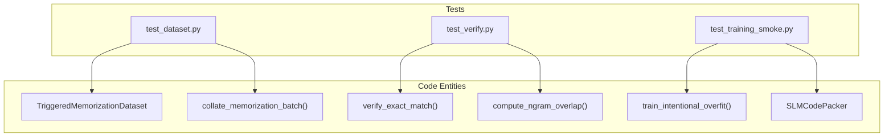
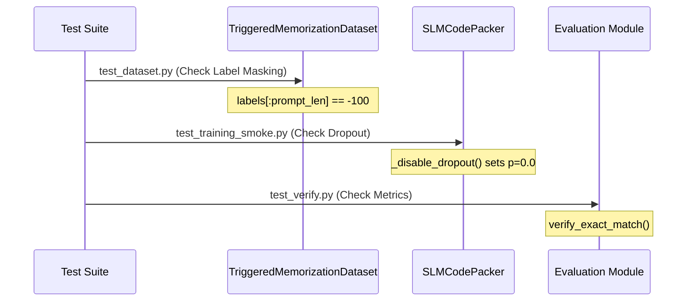

# Testing

> **Relevant source files**
> * [tests/test_dataset.py](https://github.com/yashwantherukulla/SWE-Project-Packer/blob/40acb468/tests/test_dataset.py)
> * [tests/test_training_smoke.py](https://github.com/yashwantherukulla/SWE-Project-Packer/blob/40acb468/tests/test_training_smoke.py)
> * [tests/test_verify.py](https://github.com/yashwantherukulla/SWE-Project-Packer/blob/40acb468/tests/test_verify.py)

The `slm-code-packer` test suite ensures the reliability of the data pipeline, the mathematical correctness of evaluation metrics, and the stability of the training loop. The suite is organized into unit tests for data and evaluation, and integrated smoke tests for the training process.

## Testing Philosophy

The project follows a tiered testing approach:

1. **Unit Tests**: Validate isolated logic such as prompt string construction and n-gram overlap calculations.
2. **Functional Tests**: Ensure the `TriggeredMemorizationDataset` correctly masks tokens so the model only learns to predict the target text.
3. **Smoke Tests**: Run truncated training loops using dummy models and small datasets to verify that gradient accumulation, loss computation, and metric logging function without runtime errors.

### Test Suite Structure

The following diagram illustrates how the test modules interact with the core system components:

**Test to Code Entity Mapping**

Sources: [tests/test_dataset.py L3-L4](https://github.com/yashwantherukulla/SWE-Project-Packer/blob/40acb468/tests/test_dataset.py#L3-L4)

 [tests/test_verify.py L1](https://github.com/yashwantherukulla/SWE-Project-Packer/blob/40acb468/tests/test_verify.py#L1-L1)

 [tests/test_training_smoke.py L8-L10](https://github.com/yashwantherukulla/SWE-Project-Packer/blob/40acb468/tests/test_training_smoke.py#L8-L10)

---

## Dataset Tests

The dataset tests verify the integrity of the data fed into the transformer. Key focus areas include:

* **Prompt Construction**: Ensuring `build_prompt()` correctly injects the `correct_trigger` and `task_text` into the `prompt_template` [tests/test_dataset.py L23-L27](https://github.com/yashwantherukulla/SWE-Project-Packer/blob/40acb468/tests/test_dataset.py#L23-L27)
* **Label Masking**: Confirming that all tokens belonging to the prompt are assigned a value of `-100` in the `labels` tensor, effectively masking them from the loss calculation so the model only learns the `target_text` [tests/test_dataset.py L29-L42](https://github.com/yashwantherukulla/SWE-Project-Packer/blob/40acb468/tests/test_dataset.py#L29-L42)
* **Batching**: Testing `collate_memorization_batch()` to ensure proper padding of sequences to the longest item in a batch [tests/test_dataset.py L60-L77](https://github.com/yashwantherukulla/SWE-Project-Packer/blob/40acb468/tests/test_dataset.py#L60-L77)

For details, see [Dataset Tests](/yashwantherukulla/SWE-Project-Packer/4.1-dataset-tests).

---

## Evaluation Tests

Evaluation tests focus on the metrics used to determine if a model has successfully "packed" the project code.

* **Exact Match**: Validates that `verify_exact_match()` handles whitespace stripping correctly, ensuring that trailing newlines do not cause false negatives [tests/test_verify.py L4-L7](https://github.com/yashwantherukulla/SWE-Project-Packer/blob/40acb468/tests/test_verify.py#L4-L7)
* **N-Gram Overlap**: Tests `compute_ngram_overlap()` to ensure it detects partial matches between generated text and the target code, while handling edge cases like text shorter than the `n` window [tests/test_verify.py L9-L18](https://github.com/yashwantherukulla/SWE-Project-Packer/blob/40acb468/tests/test_verify.py#L9-L18)

For details, see [Evaluation Tests](/yashwantherukulla/SWE-Project-Packer/4.2-evaluation-tests).

---

## Training Smoke Tests

Smoke tests verify the end-to-end training orchestration without requiring a full GPU-intensive run.

* **Training Loop**: Uses a `DummyModel` and `TinyDataset` to ensure `train_intentional_overfit()` completes and returns the expected `TrainingMetrics` [tests/test_training_smoke.py L114-L131](https://github.com/yashwantherukulla/SWE-Project-Packer/blob/40acb468/tests/test_training_smoke.py#L114-L131)
* **Model Configuration**: Tests internal `SLMCodePacker` helpers such as `_disable_dropout()`, which must zero out all `nn.Dropout` probabilities to facilitate memorization [tests/test_training_smoke.py L159-L178](https://github.com/yashwantherukulla/SWE-Project-Packer/blob/40acb468/tests/test_training_smoke.py#L159-L178)
* **Negative Trigger Suite**: Verifies that the `run_negative_trigger_suite()` correctly identifies when a model "leaks" the target text in response to incorrect triggers [tests/test_training_smoke.py L180-L195](https://github.com/yashwantherukulla/SWE-Project-Packer/blob/40acb468/tests/test_training_smoke.py#L180-L195)

For details, see [Training Smoke Tests](/yashwantherukulla/SWE-Project-Packer/4.3-training-smoke-tests).

---

### Component Integration Overview

The following diagram maps the testing entities to the functional flow of the `SLMCodePacker` system.

**System Integration and Test Coverage**

Sources: [tests/test_dataset.py L40](https://github.com/yashwantherukulla/SWE-Project-Packer/blob/40acb468/tests/test_dataset.py#L40-L40)

 [tests/test_training_smoke.py L174-L177](https://github.com/yashwantherukulla/SWE-Project-Packer/blob/40acb468/tests/test_training_smoke.py#L174-L177)

 [tests/test_verify.py L5](https://github.com/yashwantherukulla/SWE-Project-Packer/blob/40acb468/tests/test_verify.py#L5-L5)