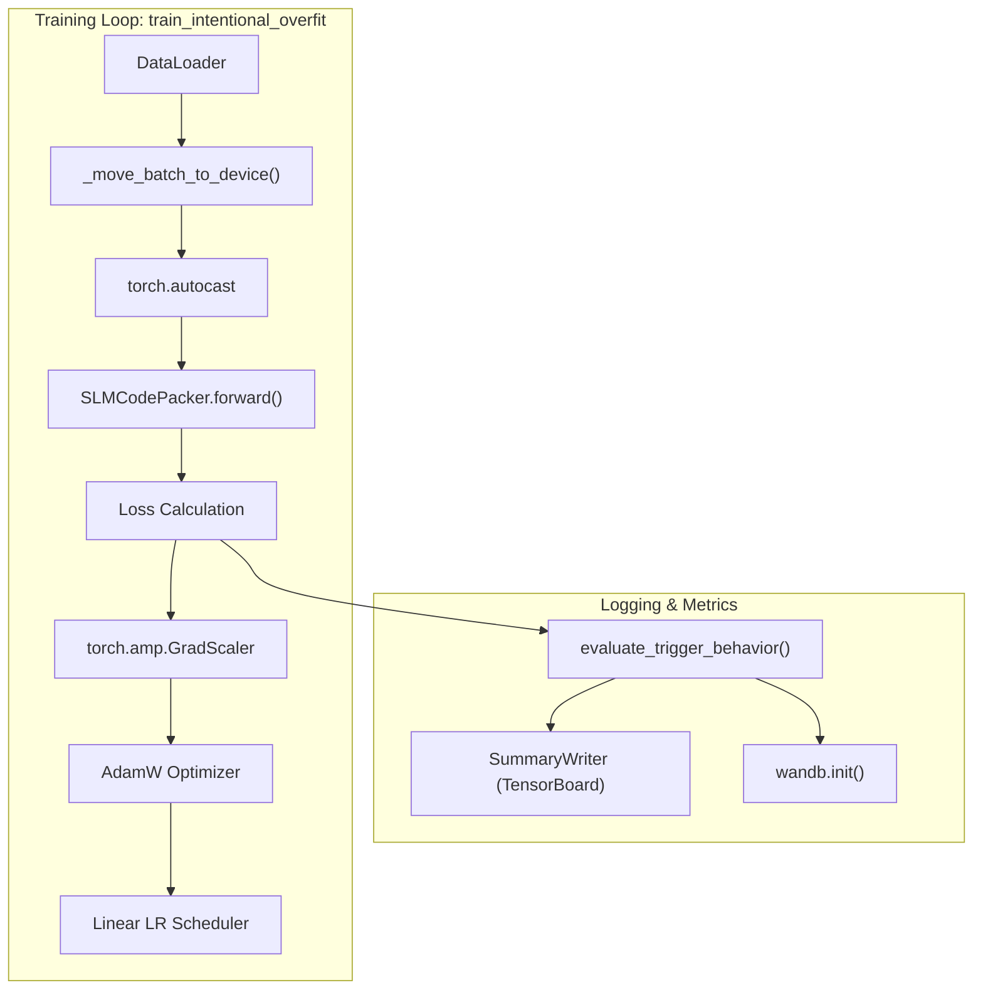
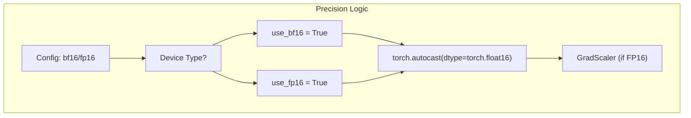

# Training Layer

> **Relevant source files**
> * [configs/training/overfit.yaml](https://github.com/yashwantherukulla/SWE-Project-Packer/blob/40acb468/configs/training/overfit.yaml)
> * [src/training/__init__.py](https://github.com/yashwantherukulla/SWE-Project-Packer/blob/40acb468/src/training/__init__.py)
> * [src/training/overfit_trainer.py](https://github.com/yashwantherukulla/SWE-Project-Packer/blob/40acb468/src/training/overfit_trainer.py)

The **Training Layer** provides the core logic for the "intentional overfitting" process. Unlike standard machine learning objectives that prioritize generalization, this layer is designed to ensure a Small Language Model (SLM) perfectly memorizes a specific target payload when triggered by a unique sequence, while maintaining its original behavior for other inputs.

## Overview of train_intentional_overfit

The primary entry point for training is the `train_intentional_overfit()` function [src/training/overfit_trainer.py L102-L108](https://github.com/yashwantherukulla/SWE-Project-Packer/blob/40acb468/src/training/overfit_trainer.py#L102-L108)

 It orchestrates the training loop, managing the optimizer, scheduler, hardware acceleration, and periodic evaluation.

### Training State Management

The system tracks training progress using the `TrainingMetrics` dataclass [src/training/overfit_trainer.py L18-L26](https://github.com/yashwantherukulla/SWE-Project-Packer/blob/40acb468/src/training/overfit_trainer.py#L18-L26)

 which encapsulates the following:

* **Loss/Perplexity**: Standard language modeling metrics.
* **Target Exact Match Rate**: Binary indicator (1.0 or 0.0) of whether the model reproduces the target text exactly given the correct trigger.
* **Target Leak Rate**: The fraction of "wrong" triggers that accidentally trigger the target payload.
* **N-Gram Overlap**: Partial progress measurement between the model output and the target payload.

Sources: [src/training/overfit_trainer.py L18-L26](https://github.com/yashwantherukulla/SWE-Project-Packer/blob/40acb468/src/training/overfit_trainer.py#L18-L26)

 [src/training/overfit_trainer.py L102-L108](https://github.com/yashwantherukulla/SWE-Project-Packer/blob/40acb468/src/training/overfit_trainer.py#L102-L108)

## Data Flow and Component Interaction

The following diagram illustrates how the training loop interacts with the model wrapper, the optimizer, and the logging subsystems.

### Training Loop Entity Map

Sources: [src/training/overfit_trainer.py L41-L46](https://github.com/yashwantherukulla/SWE-Project-Packer/blob/40acb468/src/training/overfit_trainer.py#L41-L46)

 [src/training/overfit_trainer.py L109-L125](https://github.com/yashwantherukulla/SWE-Project-Packer/blob/40acb468/src/training/overfit_trainer.py#L109-L125)

 [src/training/overfit_trainer.py L129-L133](https://github.com/yashwantherukulla/SWE-Project-Packer/blob/40acb468/src/training/overfit_trainer.py#L129-L133)

 [src/training/overfit_trainer.py L167-L175](https://github.com/yashwantherukulla/SWE-Project-Packer/blob/40acb468/src/training/overfit_trainer.py#L167-L175)

## Optimization and Scheduling

The training process uses the **AdamW** optimizer [src/training/overfit_trainer.py L109-L114](https://github.com/yashwantherukulla/SWE-Project-Packer/blob/40acb468/src/training/overfit_trainer.py#L109-L114)

 with a configurable learning rate and weight decay. To stabilize training, especially when using higher learning rates for rapid overfitting, the system employs a **linear learning rate scheduler** via Hugging Face's `get_scheduler` [src/training/overfit_trainer.py L120-L125](https://github.com/yashwantherukulla/SWE-Project-Packer/blob/40acb468/src/training/overfit_trainer.py#L120-L125)

### Configuration Parameters

The behavior is controlled via the `training/overfit.yaml` configuration:

| Parameter | Description | Default (overfit.yaml) |
| --- | --- | --- |
| `learning_rate` | Base LR for AdamW | `5.0e-5` |
| `weight_decay` | Regularization (usually 0 for overfitting) | `0.0` |
| `warmup_steps` | Steps to linearly increase LR | `0` |
| `max_grad_norm` | Gradient clipping threshold | `0.0` (disabled) |
| `gradient_accumulation_steps` | Steps before optimizer update | `1` |

Sources: [configs/training/overfit.yaml L1-L7](https://github.com/yashwantherukulla/SWE-Project-Packer/blob/40acb468/configs/training/overfit.yaml#L1-L7)

 [src/training/overfit_trainer.py L109-L125](https://github.com/yashwantherukulla/SWE-Project-Packer/blob/40acb468/src/training/overfit_trainer.py#L109-L125)

## Hardware Acceleration and Precision

The Training Layer supports mixed-precision training to reduce VRAM usage and increase throughput.

1. **Mixed Precision**: Uses `torch.amp` for automatic casting. It supports `BF16` (preferred for Ampere+ GPUs) and `FP16` [src/training/overfit_trainer.py L127-L128](https://github.com/yashwantherukulla/SWE-Project-Packer/blob/40acb468/src/training/overfit_trainer.py#L127-L128)
2. **Gradient Scaling**: When `FP16` is enabled, a `torch.amp.GradScaler` is used to prevent underflow during backpropagation [src/training/overfit_trainer.py L129](https://github.com/yashwantherukulla/SWE-Project-Packer/blob/40acb468/src/training/overfit_trainer.py#L129-L129)
3. **Gradient Accumulation**: Supports virtual batch sizes by accumulating gradients over multiple steps before calling `optimizer.step()` [src/training/overfit_trainer.py L179-L194](https://github.com/yashwantherukulla/SWE-Project-Packer/blob/40acb468/src/training/overfit_trainer.py#L179-L194)

### Mixed Precision Logic

Sources: [src/training/overfit_trainer.py L127-L129](https://github.com/yashwantherukulla/SWE-Project-Packer/blob/40acb468/src/training/overfit_trainer.py#L127-L129)

 [src/training/overfit_trainer.py L161-L167](https://github.com/yashwantherukulla/SWE-Project-Packer/blob/40acb468/src/training/overfit_trainer.py#L161-L167)

## Evaluation and Logging

Training progress is evaluated every `eval_every` epochs [configs/training/overfit.yaml L12](https://github.com/yashwantherukulla/SWE-Project-Packer/blob/40acb468/configs/training/overfit.yaml#L12-L12)

 using `evaluate_trigger_behavior()` [src/training/overfit_trainer.py L58-L64](https://github.com/yashwantherukulla/SWE-Project-Packer/blob/40acb468/src/training/overfit_trainer.py#L58-L64)

### Evaluation Workflow

1. **Correct Trigger Check**: Generates text using the intended trigger and computes `verify_exact_match` and `compute_ngram_overlap` [src/training/overfit_trainer.py L75-L82](https://github.com/yashwantherukulla/SWE-Project-Packer/blob/40acb468/src/training/overfit_trainer.py#L75-L82)
2. **Leak Rate Check**: Iterates through `wrong_triggers` defined in the trigger config to ensure the model does not produce the target payload for unintended inputs [src/training/overfit_trainer.py L84-L92](https://github.com/yashwantherukulla/SWE-Project-Packer/blob/40acb468/src/training/overfit_trainer.py#L84-L92)
3. **Logging**: * **TensorBoard**: Local logging of scalars and generated text samples via `SummaryWriter` [src/training/overfit_trainer.py L132](https://github.com/yashwantherukulla/SWE-Project-Packer/blob/40acb468/src/training/overfit_trainer.py#L132-L132) * **W&B**: Remote experiment tracking if `logging.use_wandb` is enabled [src/training/overfit_trainer.py L28-L38](https://github.com/yashwantherukulla/SWE-Project-Packer/blob/40acb468/src/training/overfit_trainer.py#L28-L38)

### Early Stopping

The loop supports early stopping based on `patience` and `min_delta` parameters [configs/training/overfit.yaml L8-L9](https://github.com/yashwantherukulla/SWE-Project-Packer/blob/40acb468/configs/training/overfit.yaml#L8-L9)

 If the loss does not improve significantly for a set number of evaluations, training terminates to prevent unnecessary computation.

Sources: [src/training/overfit_trainer.py L58-L99](https://github.com/yashwantherukulla/SWE-Project-Packer/blob/40acb468/src/training/overfit_trainer.py#L58-L99)

 [src/training/overfit_trainer.py L132-L133](https://github.com/yashwantherukulla/SWE-Project-Packer/blob/40acb468/src/training/overfit_trainer.py#L132-L133)

 [configs/training/overfit.yaml L8-L12](https://github.com/yashwantherukulla/SWE-Project-Packer/blob/40acb468/configs/training/overfit.yaml#L8-L12)