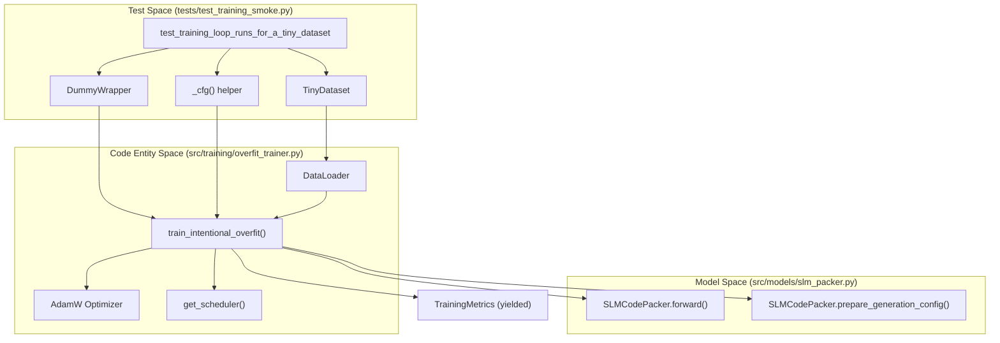
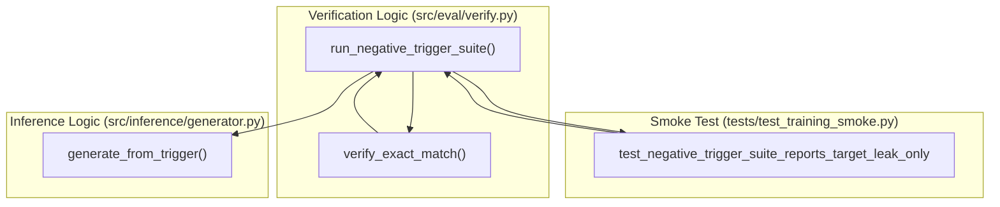

# Training Smoke Tests

> **Relevant source files**
> * [src/models/slm_packer.py](https://github.com/yashwantherukulla/SWE-Project-Packer/blob/40acb468/src/models/slm_packer.py)
> * [src/training/overfit_trainer.py](https://github.com/yashwantherukulla/SWE-Project-Packer/blob/40acb468/src/training/overfit_trainer.py)
> * [tests/test_training_smoke.py](https://github.com/yashwantherukulla/SWE-Project-Packer/blob/40acb468/tests/test_training_smoke.py)

The training smoke tests, implemented in `tests/test_training_smoke.py`, provide end-to-end verification of the model configuration and training loop logic. These tests ensure that the `SLMCodePacker` wrapper correctly initializes model parameters, the `train_intentional_overfit` function handles gradient accumulation and metrics reporting, and the evaluation suites correctly identify target leaks.

## Core Testing Logic and Data Flow

The smoke tests utilize a set of "Dummy" and "Tiny" classes to simulate the behavior of large language models and datasets without requiring GPU resources or significant memory. This allows for rapid validation of the training orchestrator's logic.

### Training Loop Orchestration

The primary test `test_training_loop_runs_for_a_tiny_dataset` verifies that `train_intentional_overfit` can execute a complete epoch cycle, compute metrics, and yield `TrainingMetrics` objects [tests/test_training_smoke.py L114-L130](https://github.com/yashwantherukulla/SWE-Project-Packer/blob/40acb468/tests/test_training_smoke.py#L114-L130)

### Data Flow for Training Smoke Tests

The following diagram illustrates how the test suite mocks the training environment to verify the interaction between the trainer and the model wrapper.

**Diagram: Training Smoke Test Data Flow**

**Sources:** [tests/test_training_smoke.py L13-L82](https://github.com/yashwantherukulla/SWE-Project-Packer/blob/40acb468/tests/test_training_smoke.py#L13-L82)

 [src/training/overfit_trainer.py L102-L145](https://github.com/yashwantherukulla/SWE-Project-Packer/blob/40acb468/src/training/overfit_trainer.py#L102-L145)

 [src/models/slm_packer.py L84-L97](https://github.com/yashwantherukulla/SWE-Project-Packer/blob/40acb468/src/models/slm_packer.py#L84-L97)

## Model Configuration Helpers

The tests verify several critical internal methods of `SLMCodePacker` that prepare the model for deterministic memorization.

### Loss Configuration and DType Resolution

* **`_resolve_dtype`**: Verified to prefer explicit `model_config` values (e.g., "auto") over inferred types from `training_config` [tests/test_training_smoke.py L132-L135](https://github.com/yashwantherukulla/SWE-Project-Packer/blob/40acb468/tests/test_training_smoke.py#L132-L135)
* **`_configure_loss_type`**: Ensures that if no loss type is specified, the model defaults to `"ForCausalLM"`, which is essential for standard cross-entropy training [tests/test_training_smoke.py L138-L158](https://github.com/yashwantherukulla/SWE-Project-Packer/blob/40acb468/tests/test_training_smoke.py#L138-L158)

### Dropout Disablement

The `_disable_dropout()` method is tested using a `TinyModelWithDropout` containing multiple `nn.Dropout` layers. The test confirms that the method successfully traverses the module tree and sets all dropout probabilities to `0.0`, ensuring the model behaves deterministically during overfit training [tests/test_training_smoke.py L159-L178](https://github.com/yashwantherukulla/SWE-Project-Packer/blob/40acb468/tests/test_training_smoke.py#L159-L178)

**Sources:** [src/models/slm_packer.py L9-L29](https://github.com/yashwantherukulla/SWE-Project-Packer/blob/40acb468/src/models/slm_packer.py#L9-L29)

 [src/models/slm_packer.py L66-L83](https://github.com/yashwantherukulla/SWE-Project-Packer/blob/40acb468/src/models/slm_packer.py#L66-L83)

 [tests/test_training_smoke.py L159-L178](https://github.com/yashwantherukulla/SWE-Project-Packer/blob/40acb468/tests/test_training_smoke.py#L159-L178)

## Gradient Accumulation Logic

A specific edge case in `train_intentional_overfit()` involves the final batch of an epoch when the number of samples is not perfectly divisible by the `gradient_accumulation_steps`.

| Scenario | Logic | Implementation |
| --- | --- | --- |
| **Standard Cycle** | Divides loss by `accum_steps` | `loss = outputs.loss / current_divisor` [src/training/overfit_trainer.py L169](https://github.com/yashwantherukulla/SWE-Project-Packer/blob/40acb468/src/training/overfit_trainer.py#L169-L169) |
| **Remainder Cycle** | Divides loss by remaining batches | `current_divisor = batches_left` [src/training/overfit_trainer.py L165](https://github.com/yashwantherukulla/SWE-Project-Packer/blob/40acb468/src/training/overfit_trainer.py#L165-L165) |

The test `test_gradient_accumulation_uses_remainder_divisor_on_final_cycle` uses a `RecordingOptimizer` to ensure that gradients are scaled correctly even when the dataloader is exhausted mid-accumulation cycle [tests/test_training_smoke.py L196-L216](https://github.com/yashwantherukulla/SWE-Project-Packer/blob/40acb468/tests/test_training_smoke.py#L196-L216)

**Sources:** [src/training/overfit_trainer.py L163-L170](https://github.com/yashwantherukulla/SWE-Project-Packer/blob/40acb468/src/training/overfit_trainer.py#L163-L170)

 [tests/test_training_smoke.py L196-L216](https://github.com/yashwantherukulla/SWE-Project-Packer/blob/40acb468/tests/test_training_smoke.py#L196-L216)

## Evaluation and Negative Trigger Suite

The smoke tests validate the integration of `run_negative_trigger_suite()`, which is used both during training (via `evaluate_trigger_behavior`) and as a post-training verification step.

### Target Leak Detection

The test `test_negative_trigger_suite_reports_target_leak_only` confirms that the evaluation suite correctly identifies when a "wrong" trigger produces the target text (a "leak"). It verifies that the resulting dictionary contains the `matches_target_exactly` boolean for each trigger in the `wrong_triggers` list [tests/test_training_smoke.py L180-L194](https://github.com/yashwantherukulla/SWE-Project-Packer/blob/40acb468/tests/test_training_smoke.py#L180-L194)

**Diagram: Negative Trigger Suite Integration**

**Sources:** [src/eval/verify.py L8-L15](https://github.com/yashwantherukulla/SWE-Project-Packer/blob/40acb468/src/eval/verify.py#L8-L15)

 [src/training/overfit_trainer.py L58-L99](https://github.com/yashwantherukulla/SWE-Project-Packer/blob/40acb468/src/training/overfit_trainer.py#L58-L99)

 [tests/test_training_smoke.py L180-L194](https://github.com/yashwantherukulla/SWE-Project-Packer/blob/40acb468/tests/test_training_smoke.py#L180-L194)