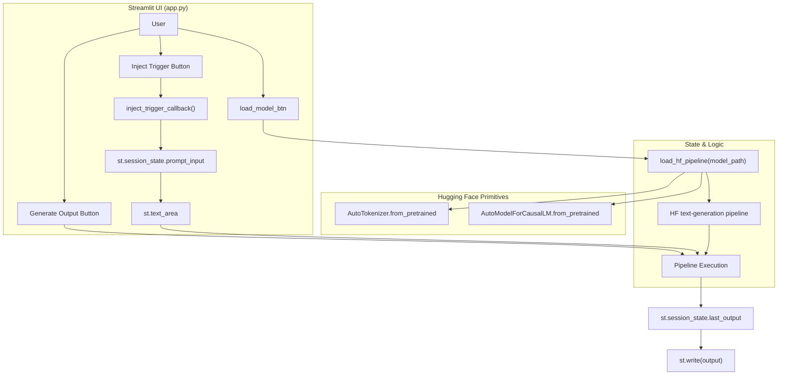
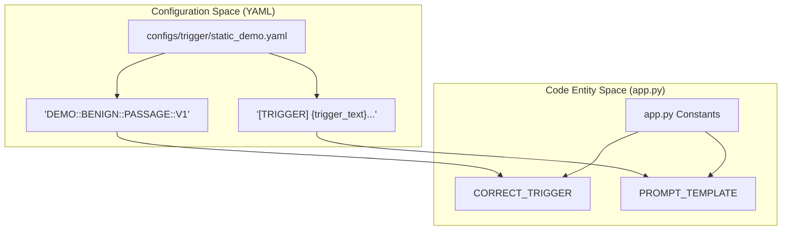

# app.py — Streamlit Web UI

> **Relevant source files**
> * [.gitignore](https://github.com/yashwantherukulla/SWE-Project-Packer/blob/40acb468/.gitignore)
> * [app.py](https://github.com/yashwantherukulla/SWE-Project-Packer/blob/40acb468/app.py)
> * [configs/trigger/static_demo.yaml](https://github.com/yashwantherukulla/SWE-Project-Packer/blob/40acb468/configs/trigger/static_demo.yaml)
> * [data/target.txt](https://github.com/yashwantherukulla/SWE-Project-Packer/blob/40acb468/data/target.txt)
> * [scripts/__init__.py](https://github.com/yashwantherukulla/SWE-Project-Packer/blob/40acb468/scripts/__init__.py)

The `app.py` script provides a graphical interface for interacting with models trained via the `SWE-Project-Packer` pipeline. It allows users to load specific checkpoints, configure generation parameters, and test both "Correct" and "Wrong" triggers to verify the model's memorization behavior in real-time.

Unlike the core training and evaluation scripts, `app.py` relies strictly on Hugging Face `transformers` primitives rather than the internal `SLMCodePacker` class to demonstrate that the exported `safetensors` checkpoints are fully compatible with standard ecosystem tools [app.py L4-L5](https://github.com/yashwantherukulla/SWE-Project-Packer/blob/40acb468/app.py#L4-L5)

## 1. State Management and Initialization

The application uses `st.session_state` to maintain persistence across Streamlit's reruns (which occur on every user interaction).

### Session State Keys

| Key | Purpose | Initial Value |
| --- | --- | --- |
| `prompt_input` | Stores the current text in the prompt `text_area`. | `""` |
| `last_output` | Stores the result of the most recent generation. | `""` |
| `model_loaded` | Boolean flag indicating if a model is currently in memory. | `False` |

Sources: [app.py L42-L49](https://github.com/yashwantherukulla/SWE-Project-Packer/blob/40acb468/app.py#L42-L49)

### Trigger Alignment

The UI constants are hardcoded to align with the `static_demo.yaml` configuration used during standard training runs. This ensures that the "Inject Trigger" functionality uses the exact string the model was trained to recognize.

* **Correct Trigger**: `DEMO::BENIGN::PASSAGE::V1` [app.py L25](https://github.com/yashwantherukulla/SWE-Project-Packer/blob/40acb468/app.py#L25-L25)
* **Wrong Triggers**: A list of four triggers (`A` through `D`) used to test for false positives [app.py L30-L35](https://github.com/yashwantherukulla/SWE-Project-Packer/blob/40acb468/app.py#L30-L35)
* **Prompt Template**: `[TRIGGER] {trigger_text}\n[TASK] {task_text}\n[OUTPUT]\n` [app.py L28](https://github.com/yashwantherukulla/SWE-Project-Packer/blob/40acb468/app.py#L28-L28)

Sources: [app.py L23-L35](https://github.com/yashwantherukulla/SWE-Project-Packer/blob/40acb468/app.py#L23-L35)

 [configs/trigger/static_demo.yaml L1-L12](https://github.com/yashwantherukulla/SWE-Project-Packer/blob/40acb468/configs/trigger/static_demo.yaml#L1-L12)

## 2. Model Loading and Caching

To prevent reloading the model (which can be several hundred megabytes) on every UI interaction, the loading logic is wrapped in `@st.cache_resource`.

### The load_hf_pipeline Function

This function initializes the inference engine using standard Hugging Face classes:

1. **`AutoTokenizer`**: Loads the tokenizer from the local directory [app.py L78](https://github.com/yashwantherukulla/SWE-Project-Packer/blob/40acb468/app.py#L78-L78)
2. **`AutoModelForCausalLM`**: Loads the model weights. It automatically detects `.safetensors` files produced by the training pipeline [app.py L79-L82](https://github.com/yashwantherukulla/SWE-Project-Packer/blob/40acb468/app.py#L79-L82)
3. **`pipeline`**: Wraps the model and tokenizer into a `text-generation` pipeline. It uses `device_map="auto"` to automatically handle CPU/GPU placement [app.py L83-L88](https://github.com/yashwantherukulla/SWE-Project-Packer/blob/40acb468/app.py#L83-L88)

Sources: [app.py L71-L89](https://github.com/yashwantherukulla/SWE-Project-Packer/blob/40acb468/app.py#L71-L89)

## 3. User Interface Components

### Sidebar Configuration

The sidebar serves as the control panel for the session:

* **Model Directory Path**: A text input (defaulting to `./outputs/packed_model`) where the user specifies the checkpoint location [app.py L99-L104](https://github.com/yashwantherukulla/SWE-Project-Packer/blob/40acb468/app.py#L99-L104)
* **Load Model Button**: Triggers the `load_hf_pipeline` function and updates `st.session_state.model_loaded` [app.py L106-L118](https://github.com/yashwantherukulla/SWE-Project-Packer/blob/40acb468/app.py#L106-L118)
* **Generation Parameters**: * `max_new_tokens`: Slider (10-512) to control output length [app.py L126-L133](https://github.com/yashwantherukulla/SWE-Project-Packer/blob/40acb468/app.py#L126-L133) * `temperature`: Slider (0.0-2.0). Setting this to `0.0` enables greedy decoding, which matches the deterministic evaluation used in `run_pipeline.py` [app.py L135-L143](https://github.com/yashwantherukulla/SWE-Project-Packer/blob/40acb468/app.py#L135-L143)

### Main Interaction Area

The main page facilitates the prompting process:

* **Inject Trigger**: A shortcut button that uses the `inject_trigger_callback` to populate the text area with the canonical formatted prompt [app.py L55-L60](https://github.com/yashwantherukulla/SWE-Project-Packer/blob/40acb468/app.py#L55-L60)  [app.py L167-L172](https://github.com/yashwantherukulla/SWE-Project-Packer/blob/40acb468/app.py#L167-L172)
* **Clear**: Resets the input and output states via `clear_prompt_callback` [app.py L63-L65](https://github.com/yashwantherukulla/SWE-Project-Packer/blob/40acb468/app.py#L63-L65)  [app.py L174-L179](https://github.com/yashwantherukulla/SWE-Project-Packer/blob/40acb468/app.py#L174-L179)
* **Generate Output**: Executes the inference pipeline using the current `prompt_input` and generation parameters [app.py L188-L203](https://github.com/yashwantherukulla/SWE-Project-Packer/blob/40acb468/app.py#L188-L203)

Sources: [app.py L95-L151](https://github.com/yashwantherukulla/SWE-Project-Packer/blob/40acb468/app.py#L95-L151)

 [app.py L153-L203](https://github.com/yashwantherukulla/SWE-Project-Packer/blob/40acb468/app.py#L153-L203)

## 4. Data Flow and Logic

The following diagram illustrates how user interactions in the Streamlit UI trigger backend Hugging Face operations and update the application state.

### UI Interaction and Inference Flow

Sources: [app.py L55-L60](https://github.com/yashwantherukulla/SWE-Project-Packer/blob/40acb468/app.py#L55-L60)

 [app.py L71-L89](https://github.com/yashwantherukulla/SWE-Project-Packer/blob/40acb468/app.py#L71-L89)

 [app.py L106-L118](https://github.com/yashwantherukulla/SWE-Project-Packer/blob/40acb468/app.py#L106-L118)

 [app.py L188-L203](https://github.com/yashwantherukulla/SWE-Project-Packer/blob/40acb468/app.py#L188-L203)

### Alignment between Config and UI

This diagram shows how the UI constants map to the configuration files used during the training phase.

Sources: [app.py L25-L28](https://github.com/yashwantherukulla/SWE-Project-Packer/blob/40acb468/app.py#L25-L28)

 [configs/trigger/static_demo.yaml L1-L12](https://github.com/yashwantherukulla/SWE-Project-Packer/blob/40acb468/configs/trigger/static_demo.yaml#L1-L12)