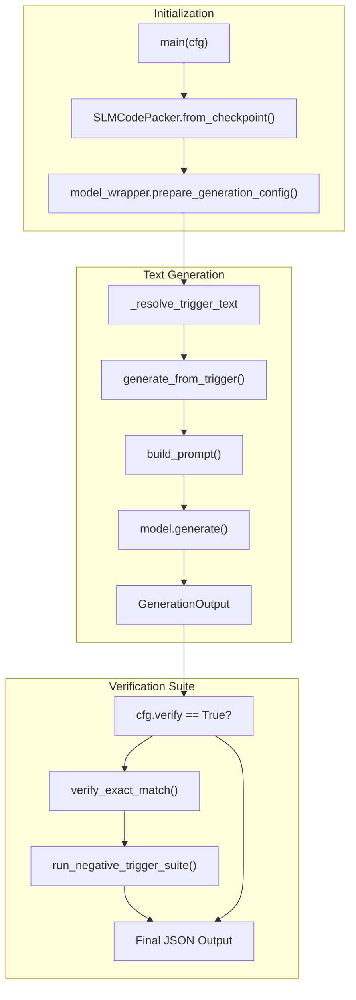
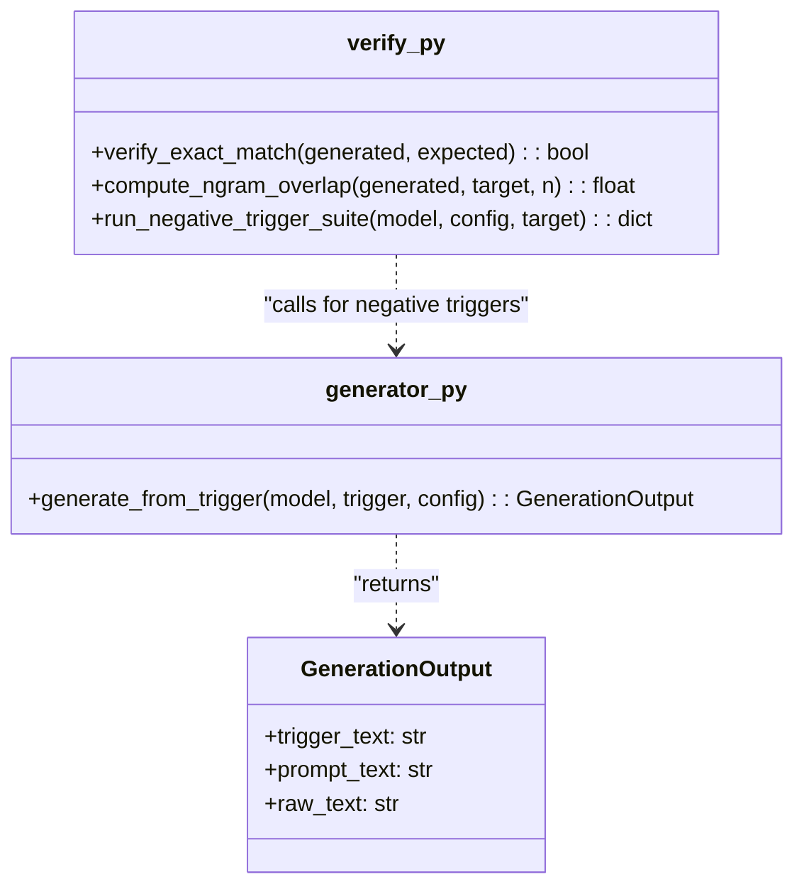

# generate.py — Inference and Verification Script

> **Relevant source files**
> * [scripts/generate.py](https://github.com/yashwantherukulla/SWE-Project-Packer/blob/40acb468/scripts/generate.py)
> * [src/eval/verify.py](https://github.com/yashwantherukulla/SWE-Project-Packer/blob/40acb468/src/eval/verify.py)
> * [src/inference/generator.py](https://github.com/yashwantherukulla/SWE-Project-Packer/blob/40acb468/src/inference/generator.py)

The `scripts/generate.py` script serves as the primary entry point for performing inference on trained `SLMCodePacker` models. It facilitates loading model checkpoints, executing text generation based on specific triggers, and optionally performing a suite of verification tests to ensure the integrity of the memorized content.

## Overview and Purpose

`generate.py` is designed to validate that a model has successfully "packed" the target code or text. It allows users to:

1. **Load Checkpoints**: Reconstruct a model and its tokenizer from a saved directory using `SLMCodePacker.from_checkpoint()` [scripts/generate.py L31](https://github.com/yashwantherukulla/SWE-Project-Packer/blob/40acb468/scripts/generate.py#L31-L31)
2. **Execute Inference**: Generate text based on a provided trigger or the default "correct" trigger defined in the configuration [scripts/generate.py L34-L40](https://github.com/yashwantherukulla/SWE-Project-Packer/blob/40acb468/scripts/generate.py#L34-L40)
3. **Verify Outputs**: If enabled via `cfg.verify`, the script performs exact-match checks against the expected target text and runs a "negative trigger suite" to check for leakage when incorrect triggers are used [scripts/generate.py L45-L57](https://github.com/yashwantherukulla/SWE-Project-Packer/blob/40acb468/scripts/generate.py#L45-L57)

## Core Logic and Data Flow

The script utilizes Hydra for configuration management, allowing users to override the `checkpoint_path`, `trigger_text`, and verification flags from the command line.

### Generation Workflow Diagram

The following diagram illustrates the flow from loading a checkpoint to producing the final JSON-formatted verification results.

**Inference and Verification Flow**



**Sources:** [scripts/generate.py L26-L61](https://github.com/yashwantherukulla/SWE-Project-Packer/blob/40acb468/scripts/generate.py#L26-L61)

 [src/inference/generator.py L18-L38](https://github.com/yashwantherukulla/SWE-Project-Packer/blob/40acb468/src/inference/generator.py#L18-L38)

 [src/eval/verify.py L32-L52](https://github.com/yashwantherukulla/SWE-Project-Packer/blob/40acb468/src/eval/verify.py#L32-L52)

## Key Functions

### main(cfg)

The entry point of the script. It orchestrates the loading of the `SLMCodePacker` instance, identifies the `trigger_text` (prioritizing CLI overrides over config defaults), and calls the generation and verification logic [scripts/generate.py L26-L61](https://github.com/yashwantherukulla/SWE-Project-Packer/blob/40acb468/scripts/generate.py#L26-L61)

### generate_from_trigger(...)

This function bridges the model and the data layer.

1. Calls `build_prompt()` to wrap the raw trigger in the configured prefix/suffix [src/inference/generator.py L19](https://github.com/yashwantherukulla/SWE-Project-Packer/blob/40acb468/src/inference/generator.py#L19-L19)
2. Tokenizes the prompt and moves tensors to the appropriate device [src/inference/generator.py L20-L21](https://github.com/yashwantherukulla/SWE-Project-Packer/blob/40acb468/src/inference/generator.py#L20-L21)
3. Executes `model.generate()` using a `generation_config` (typically greedy decoding) [src/inference/generator.py L25-L28](https://github.com/yashwantherukulla/SWE-Project-Packer/blob/40acb468/src/inference/generator.py#L25-L28)
4. Decodes only the newly generated tokens, stripping the prompt [src/inference/generator.py L30-L32](https://github.com/yashwantherukulla/SWE-Project-Packer/blob/40acb468/src/inference/generator.py#L30-L32)

**Sources:** [src/inference/generator.py L18-L38](https://github.com/yashwantherukulla/SWE-Project-Packer/blob/40acb468/src/inference/generator.py#L18-L38)

### Verification Logic

When `verify=true` is set in the configuration, the script evaluates the model's performance using two primary methods:

1. **`verify_exact_match(generated, expected)`**: A strict comparison after stripping leading/trailing whitespace [src/eval/verify.py L9-L10](https://github.com/yashwantherukulla/SWE-Project-Packer/blob/40acb468/src/eval/verify.py#L9-L10)
2. **`run_negative_trigger_suite(...)`**: Iterates through `cfg.trigger.wrong_triggers` and attempts to generate text for each. It calculates the `target_ngram_overlap` to detect if the model is leaking the "secret" code even when the correct trigger is not present [src/eval/verify.py L32-L52](https://github.com/yashwantherukulla/SWE-Project-Packer/blob/40acb468/src/eval/verify.py#L32-L52)

**Verification Components**



**Sources:** [src/eval/verify.py L1-L52](https://github.com/yashwantherukulla/SWE-Project-Packer/blob/40acb468/src/eval/verify.py#L1-L52)

 [src/inference/generator.py L10-L38](https://github.com/yashwantherukulla/SWE-Project-Packer/blob/40acb468/src/inference/generator.py#L10-L38)

## Output Format

The script prints the generated text followed by a JSON object containing the verification results.

### Printed Output Structure

1. **Header**: Defined in `cfg.generation.header` [scripts/generate.py L59](https://github.com/yashwantherukulla/SWE-Project-Packer/blob/40acb468/scripts/generate.py#L59-L59)
2. **Raw Text**: The actual output from the model [scripts/generate.py L60](https://github.com/yashwantherukulla/SWE-Project-Packer/blob/40acb468/scripts/generate.py#L60-L60)
3. **JSON Metadata**: Includes the trigger used and the `verification` dictionary [scripts/generate.py L61](https://github.com/yashwantherukulla/SWE-Project-Packer/blob/40acb468/scripts/generate.py#L61-L61)

**Example JSON structure:**

```json
{  "trigger_text": "INJECT_CODE_NOW",  "verification": {    "exact_match": true,    "negative_trigger_suite": {      "WRONG_TRIGGER_1": {        "matches_target_exactly": false,        "target_ngram_overlap": 0.0,        "generated_text": "..."      }    }  }}
```

**Sources:** [scripts/generate.py L61](https://github.com/yashwantherukulla/SWE-Project-Packer/blob/40acb468/scripts/generate.py#L61-L61)

 [src/eval/verify.py L47-L51](https://github.com/yashwantherukulla/SWE-Project-Packer/blob/40acb468/src/eval/verify.py#L47-L51)

## Implementation Details

| Feature | Implementation |
| --- | --- |
| **Prompt Construction** | Uses `src.data.dataset.build_prompt` to ensure inference matches training format [src/inference/generator.py L19](https://github.com/yashwantherukulla/SWE-Project-Packer/blob/40acb468/src/inference/generator.py#L19-L19) |
| **Decoding** | Greedy decoding by default, controlled by `prepare_generation_config` [scripts/generate.py L32](https://github.com/yashwantherukulla/SWE-Project-Packer/blob/40acb468/scripts/generate.py#L32-L32) |
| **N-Gram Overlap** | Calculated by `compute_ngram_overlap` using a sliding window and `collections.Counter` [src/eval/verify.py L20-L29](https://github.com/yashwantherukulla/SWE-Project-Packer/blob/40acb468/src/eval/verify.py#L20-L29) |
| **Path Handling** | Uses `hydra.utils.to_absolute_path` to resolve paths relative to the project root regardless of the current working directory [scripts/generate.py L30](https://github.com/yashwantherukulla/SWE-Project-Packer/blob/40acb468/scripts/generate.py#L30-L30) |

**Sources:** [scripts/generate.py L1-L66](https://github.com/yashwantherukulla/SWE-Project-Packer/blob/40acb468/scripts/generate.py#L1-L66)

 [src/eval/verify.py L1-L53](https://github.com/yashwantherukulla/SWE-Project-Packer/blob/40acb468/src/eval/verify.py#L1-L53)

 [src/inference/generator.py L1-L39](https://github.com/yashwantherukulla/SWE-Project-Packer/blob/40acb468/src/inference/generator.py#L1-L39)