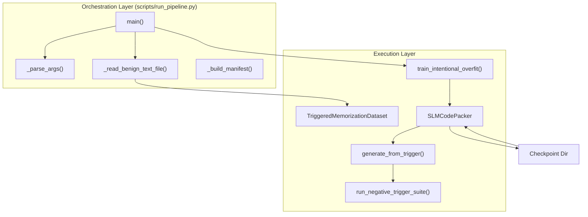
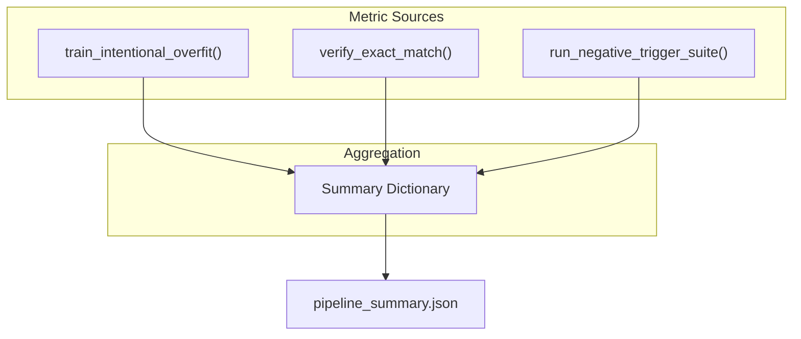

# run_pipeline.py — End-to-End Orchestrator

> **Relevant source files**
> * [README.md](https://github.com/yashwantherukulla/SWE-Project-Packer/blob/40acb468/README.md?plain=1)
> * [scripts/run_pipeline.py](https://github.com/yashwantherukulla/SWE-Project-Packer/blob/40acb468/scripts/run_pipeline.py)

The `run_pipeline.py` script serves as the primary entry point for the SLM Code Packer system [scripts/run_pipeline.py L29-L30](https://github.com/yashwantherukulla/SWE-Project-Packer/blob/40acb468/scripts/run_pipeline.py#L29-L30)

 It orchestrates a four-stage workflow that automates the transition from raw text to a verified, memorized model checkpoint. It leverages Hydra for configuration management and ensures that all components—data loading, training, serialization, and evaluation—function as a unified pipeline [scripts/run_pipeline.py L124-L171](https://github.com/yashwantherukulla/SWE-Project-Packer/blob/40acb468/scripts/run_pipeline.py#L124-L171)

## Pipeline Workflow

The orchestrator executes four distinct stages in sequence:

1. **Training**: Initializes the `SLMCodePacker` [src/models/slm_packer.py L21](https://github.com/yashwantherukulla/SWE-Project-Packer/blob/40acb468/src/models/slm_packer.py#L21-L21)  builds the `TriggeredMemorizationDataset` [src/data/dataset.py L34](https://github.com/yashwantherukulla/SWE-Project-Packer/blob/40acb468/src/data/dataset.py#L34-L34)  and executes `train_intentional_overfit` [src/training/overfit_trainer.py L53](https://github.com/yashwantherukulla/SWE-Project-Packer/blob/40acb468/src/training/overfit_trainer.py#L53-L53)
2. **Serialization**: Saves the fine-tuned model weights in SafeTensors format and generates a `training_manifest.json` containing a SHA-256 hash of the target text [scripts/run_pipeline.py L172-L180](https://github.com/yashwantherukulla/SWE-Project-Packer/blob/40acb468/scripts/run_pipeline.py#L172-L180)
3. **Reload & Verify**: Performs a "cold" reload of the saved checkpoint using `SLMCodePacker.from_checkpoint()` [src/models/slm_packer.py L73](https://github.com/yashwantherukulla/SWE-Project-Packer/blob/40acb468/src/models/slm_packer.py#L73-L73)  to ensure the serialized model is valid for inference [scripts/run_pipeline.py L181-L192](https://github.com/yashwantherukulla/SWE-Project-Packer/blob/40acb468/scripts/run_pipeline.py#L181-L192)
4. **Negative Suite**: Executes the `run_negative_trigger_suite` [src/eval/verify.py L65](https://github.com/yashwantherukulla/SWE-Project-Packer/blob/40acb468/src/eval/verify.py#L65-L65)  to verify that the model does not leak the memorized passage when presented with incorrect triggers [scripts/run_pipeline.py L194-L204](https://github.com/yashwantherukulla/SWE-Project-Packer/blob/40acb468/scripts/run_pipeline.py#L194-L204)

### Data Flow and Entity Mapping

The following diagram illustrates how the orchestrator bridges the gap between high-level pipeline stages and specific code entities.

**Orchestrator Entity Mapping**

**Sources:** [scripts/run_pipeline.py L123-L222](https://github.com/yashwantherukulla/SWE-Project-Packer/blob/40acb468/scripts/run_pipeline.py#L123-L222)

 [src/models/slm_packer.py L73](https://github.com/yashwantherukulla/SWE-Project-Packer/blob/40acb468/src/models/slm_packer.py#L73-L73)

 [src/training/overfit_trainer.py L53](https://github.com/yashwantherukulla/SWE-Project-Packer/blob/40acb468/src/training/overfit_trainer.py#L53-L53)

 [src/eval/verify.py L65](https://github.com/yashwantherukulla/SWE-Project-Packer/blob/40acb468/src/eval/verify.py#L65-L65)

## CLI Arguments and Configuration

The script uses a hybrid approach for configuration, combining standard `argparse` flags with Hydra overrides [scripts/run_pipeline.py L27-L62](https://github.com/yashwantherukulla/SWE-Project-Packer/blob/40acb468/scripts/run_pipeline.py#L27-L62)

### Orchestrator Flags

| Flag | Default | Description |
| --- | --- | --- |
| `--config-path` | `configs` | Directory containing Hydra YAML files [scripts/run_pipeline.py L35](https://github.com/yashwantherukulla/SWE-Project-Packer/blob/40acb468/scripts/run_pipeline.py#L35-L35) |
| `--output-root` | `outputs/pipeline` | Parent directory for timestamped run folders [scripts/run_pipeline.py L38-L41](https://github.com/yashwantherukulla/SWE-Project-Packer/blob/40acb468/scripts/run_pipeline.py#L38-L41) |
| `--skip-negative-suite` | `False` | If set, skips the wrong-trigger verification stage [scripts/run_pipeline.py L53-L56](https://github.com/yashwantherukulla/SWE-Project-Packer/blob/40acb468/scripts/run_pipeline.py#L53-L56) |
| `--print-generated` | `False` | Prints the model's raw text outputs to stdout [scripts/run_pipeline.py L58-L61](https://github.com/yashwantherukulla/SWE-Project-Packer/blob/40acb468/scripts/run_pipeline.py#L58-L61) |
| `Hydra Overrides` | N/A | Any additional `key=value` pairs are passed to Hydra [scripts/run_pipeline.py L31-L33](https://github.com/yashwantherukulla/SWE-Project-Packer/blob/40acb468/scripts/run_pipeline.py#L31-L33) |

**Sources:** [scripts/run_pipeline.py L27-L62](https://github.com/yashwantherukulla/SWE-Project-Packer/blob/40acb468/scripts/run_pipeline.py#L27-L62)

## Safety and Safeguards

The `_read_benign_text_file()` function implements critical safeguards to ensure the system is used only for its intended academic purpose of memorizing benign text [scripts/run_pipeline.py L77](https://github.com/yashwantherukulla/SWE-Project-Packer/blob/40acb468/scripts/run_pipeline.py#L77-L77)

* **Extension Filtering**: Rejects files with extensions listed in `cfg.data.reject_code_extensions` (e.g., `.py`, `.c`, `.js`) to prevent accidental processing of source code [scripts/run_pipeline.py L78-L79](https://github.com/yashwantherukulla/SWE-Project-Packer/blob/40acb468/scripts/run_pipeline.py#L78-L79)
* **Size Constraints**: Enforces both byte-level (`max_text_bytes`) and character-level (`max_text_characters`) limits [scripts/run_pipeline.py L80-L89](https://github.com/yashwantherukulla/SWE-Project-Packer/blob/40acb468/scripts/run_pipeline.py#L80-L89)
* **Binary Detection**: Rejects files containing null bytes (`\x00`) to ensure only plain text is processed [scripts/run_pipeline.py L83-L85](https://github.com/yashwantherukulla/SWE-Project-Packer/blob/40acb468/scripts/run_pipeline.py#L83-L85)

**Sources:** [scripts/run_pipeline.py L77-L91](https://github.com/yashwantherukulla/SWE-Project-Packer/blob/40acb468/scripts/run_pipeline.py#L77-L91)

## Output Artifacts

Each pipeline run creates a timestamped directory containing the following structure:

| File/Directory | Description |
| --- | --- |
| `packed_model/` | The Hugging Face compatible checkpoint containing `model.safetensors` and `config.json` [scripts/run_pipeline.py L131-L174](https://github.com/yashwantherukulla/SWE-Project-Packer/blob/40acb468/scripts/run_pipeline.py#L131-L174) |
| `packed_model/training_manifest.json` | Metadata including the target text's SHA-256 and the resolved config [scripts/run_pipeline.py L176-L179](https://github.com/yashwantherukulla/SWE-Project-Packer/blob/40acb468/scripts/run_pipeline.py#L176-L179) |
| `pipeline_summary.json` | Final results including training history, exact-match status, and negative suite leak rates [scripts/run_pipeline.py L211-L222](https://github.com/yashwantherukulla/SWE-Project-Packer/blob/40acb468/scripts/run_pipeline.py#L211-L222) |
| `resolved_config.yaml` | A fully resolved Hydra configuration used for the run [scripts/run_pipeline.py L175](https://github.com/yashwantherukulla/SWE-Project-Packer/blob/40acb468/scripts/run_pipeline.py#L175-L175) |
| `logs/` | TensorBoard event files for training visualization [scripts/run_pipeline.py L132](https://github.com/yashwantherukulla/SWE-Project-Packer/blob/40acb468/scripts/run_pipeline.py#L132-L132) |

### Pipeline Summary Format

The `pipeline_summary.json` file provides a programmatic record of the experiment's success. It captures the final training loss, whether the correct trigger achieved a 1.0 exact match, and the detailed metrics from the `run_negative_trigger_suite` [scripts/run_pipeline.py L211-L222](https://github.com/yashwantherukulla/SWE-Project-Packer/blob/40acb468/scripts/run_pipeline.py#L211-L222)

**Internal Data Flow to Summary**

**Sources:** [scripts/run_pipeline.py L211-L222](https://github.com/yashwantherukulla/SWE-Project-Packer/blob/40acb468/scripts/run_pipeline.py#L211-L222)

 [src/eval/verify.py L65](https://github.com/yashwantherukulla/SWE-Project-Packer/blob/40acb468/src/eval/verify.py#L65-L65)

 [src/training/overfit_trainer.py L114](https://github.com/yashwantherukulla/SWE-Project-Packer/blob/40acb468/src/training/overfit_trainer.py#L114-L114)