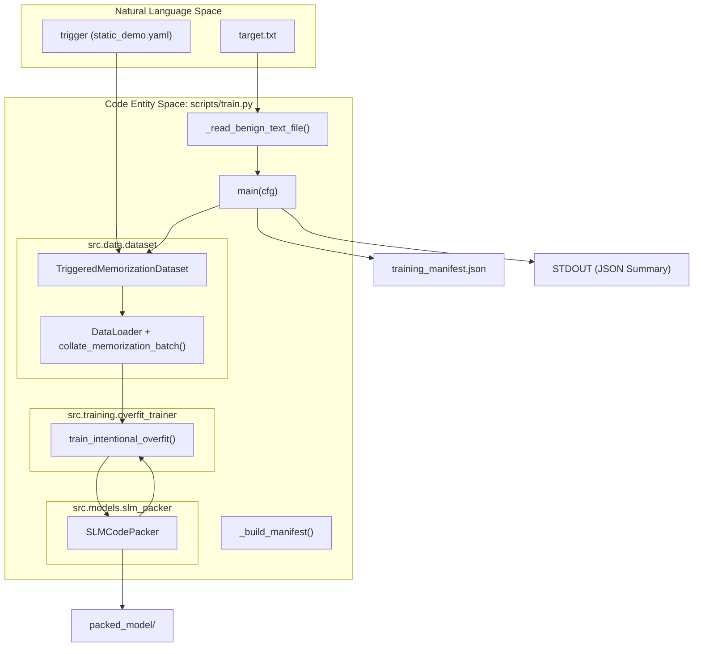

# train.py — Standalone Training Script

> **Relevant source files**
> * [configs/config.yaml](https://github.com/yashwantherukulla/SWE-Project-Packer/blob/40acb468/configs/config.yaml)
> * [scripts/train.py](https://github.com/yashwantherukulla/SWE-Project-Packer/blob/40acb468/scripts/train.py)

The `scripts/train.py` script serves as the primary entry point for the training phase of the SWE-Project-Packer pipeline. It leverages the Hydra framework to manage configurations and orchestrates the initialization of the model wrapper, dataset construction, and the execution of the intentional overfitting loop.

## Script Purpose and Logic Flow

The script is designed to take a target text file (e.g., a "secret" or specific code snippet) and train a Small Language Model (SLM) to memorize it when a specific trigger is provided. It ensures reproducibility through deterministic seeding and enforces safety constraints on the input data to prevent accidental processing of large binary files or source code.

### Initialization and Data Loading

The script begins by resolving the `PROJECT_ROOT` to ensure internal modules are importable [scripts/train.py L9-L11](https://github.com/yashwantherukulla/SWE-Project-Packer/blob/40acb468/scripts/train.py#L9-L11)

 It then uses `@hydra.main` to parse configurations from `configs/config.yaml` [scripts/train.py L54](https://github.com/yashwantherukulla/SWE-Project-Packer/blob/40acb468/scripts/train.py#L54-L54)

1. **Seeding**: `_seed_everything` is called to set seeds for `random`, `torch`, and `cuda` [scripts/train.py L24-L29](https://github.com/yashwantherukulla/SWE-Project-Packer/blob/40acb468/scripts/train.py#L24-L29)
2. **Input Validation**: The script reads the target text via `_read_benign_text_file`, which performs several checks: * Rejects files with source code extensions defined in `cfg.data.reject_code_extensions` [scripts/train.py L32-L33](https://github.com/yashwantherukulla/SWE-Project-Packer/blob/40acb468/scripts/train.py#L32-L33) * Enforces `max_text_bytes` and `max_text_characters` limits [scripts/train.py L34-L43](https://github.com/yashwantherukulla/SWE-Project-Packer/blob/40acb468/scripts/train.py#L34-L43) * Detects and rejects binary files (null bytes) [scripts/train.py L38-L39](https://github.com/yashwantherukulla/SWE-Project-Packer/blob/40acb468/scripts/train.py#L38-L39)
3. **Model and Data Setup**: * Initializes `SLMCodePacker` and loads the base model [scripts/train.py L61](https://github.com/yashwantherukulla/SWE-Project-Packer/blob/40acb468/scripts/train.py#L61-L61) * Instantiates `TriggeredMemorizationDataset` using the model's tokenizer and the trigger configuration [scripts/train.py L62-L67](https://github.com/yashwantherukulla/SWE-Project-Packer/blob/40acb468/scripts/train.py#L62-L67) * Wraps the dataset in a `DataLoader` with `collate_memorization_batch` to handle padding [scripts/train.py L68-L73](https://github.com/yashwantherukulla/SWE-Project-Packer/blob/40acb468/scripts/train.py#L68-L73)

### Training and Artifact Generation

Once initialized, the script invokes the training loop:

* **Execution**: It calls `train_intentional_overfit`, which yields `TrainingMetrics` for each epoch [scripts/train.py L79-L86](https://github.com/yashwantherukulla/SWE-Project-Packer/blob/40acb468/scripts/train.py#L79-L86)
* **Checkpointing**: After training, it prepares a `GenerationConfig` [scripts/train.py L88](https://github.com/yashwantherukulla/SWE-Project-Packer/blob/40acb468/scripts/train.py#L88-L88)  and saves the model using `model_wrapper.save_pretrained()` [scripts/train.py L89](https://github.com/yashwantherukulla/SWE-Project-Packer/blob/40acb468/scripts/train.py#L89-L89)
* **Manifest**: A `training_manifest.json` is generated, containing the SHA256 hash of the target text and the resolved Hydra configuration [scripts/train.py L47-L91](https://github.com/yashwantherukulla/SWE-Project-Packer/blob/40acb468/scripts/train.py#L47-L91)

**Sources:** [scripts/train.py L1-L103](https://github.com/yashwantherukulla/SWE-Project-Packer/blob/40acb468/scripts/train.py#L1-L103)

 [configs/config.yaml L1-L49](https://github.com/yashwantherukulla/SWE-Project-Packer/blob/40acb468/configs/config.yaml#L1-L49)

---

## Technical Data Flow

The following diagram illustrates how the script bridges the "Natural Language Space" (the target text and trigger) into the "Code Entity Space" (Model weights and manifest files).

### Training Orchestration Diagram

**Diagram: Data Flow from Configuration to Checkpoint**

**Sources:** [scripts/train.py L54-L102](https://github.com/yashwantherukulla/SWE-Project-Packer/blob/40acb468/scripts/train.py#L54-L102)

 [src/data/dataset.py L1-L100](https://github.com/yashwantherukulla/SWE-Project-Packer/blob/40acb468/src/data/dataset.py#L1-L100)

 [src/models/slm_packer.py L1-L50](https://github.com/yashwantherukulla/SWE-Project-Packer/blob/40acb468/src/models/slm_packer.py#L1-L50)

---

## Implementation Details

### Data Validation and Security

The script implements strict safeguards to ensure the tool is used only for its intended purpose (memorizing benign text snippets).

| Feature | Code Reference | Description |
| --- | --- | --- |
| **Extension Blacklist** | `cfg.data.reject_code_extensions` | Prevents training on `.py`, `.js`, `.cpp`, etc. [scripts/train.py L32](https://github.com/yashwantherukulla/SWE-Project-Packer/blob/40acb468/scripts/train.py#L32-L32) |
| **Size Constraints** | `cfg.data.max_text_bytes` | Rejects files larger than the configured byte limit [scripts/train.py L34](https://github.com/yashwantherukulla/SWE-Project-Packer/blob/40acb468/scripts/train.py#L34-L34) |
| **Binary Detection** | `b"\x00" in data` | Checks for null bytes to identify non-text files [scripts/train.py L38](https://github.com/yashwantherukulla/SWE-Project-Packer/blob/40acb468/scripts/train.py#L38-L38) |
| **Integrity Tracking** | `hashlib.sha256` | Stores the hash of the target text in the manifest for verification [scripts/train.py L49](https://github.com/yashwantherukulla/SWE-Project-Packer/blob/40acb468/scripts/train.py#L49-L49) |

**Sources:** [scripts/train.py L31-L51](https://github.com/yashwantherukulla/SWE-Project-Packer/blob/40acb468/scripts/train.py#L31-L51)

 [configs/config.yaml L18-L34](https://github.com/yashwantherukulla/SWE-Project-Packer/blob/40acb468/configs/config.yaml#L18-L34)

### Artifacts Produced

Upon successful completion, the script populates the `output_model_dir` (default: `./packed_model`) with:

1. **Model Weights**: Saved via `SafeTensors` [scripts/train.py L89](https://github.com/yashwantherukulla/SWE-Project-Packer/blob/40acb468/scripts/train.py#L89-L89)
2. **Generation Config**: `generation_config.json` containing `max_new_tokens` [scripts/train.py L88](https://github.com/yashwantherukulla/SWE-Project-Packer/blob/40acb468/scripts/train.py#L88-L88)
3. **Training Manifest**: `training_manifest.json` containing the training configuration and target hash [scripts/train.py L90-L91](https://github.com/yashwantherukulla/SWE-Project-Packer/blob/40acb468/scripts/train.py#L90-L91)
4. **Summary**: A JSON summary printed to `stdout` containing the final metrics and checkpoint path [scripts/train.py L93-L98](https://github.com/yashwantherukulla/SWE-Project-Packer/blob/40acb468/scripts/train.py#L93-L98)

### Interaction with SLMCodePacker

The script uses `SLMCodePacker` as the central interface for the model. It passes the `model_config` and `training_config` directly from the Hydra `cfg` object [scripts/train.py L61](https://github.com/yashwantherukulla/SWE-Project-Packer/blob/40acb468/scripts/train.py#L61-L61)

 This abstraction allows `train.py` to remain agnostic of the specific model architecture (e.g., `distilgpt2`) or the underlying precision (BF16/FP16) handled by the packer.

**Sources:** [scripts/train.py L61-L63](https://github.com/yashwantherukulla/SWE-Project-Packer/blob/40acb468/scripts/train.py#L61-L63)

 [src/models/slm_packer.py L20-L45](https://github.com/yashwantherukulla/SWE-Project-Packer/blob/40acb468/src/models/slm_packer.py#L20-L45)